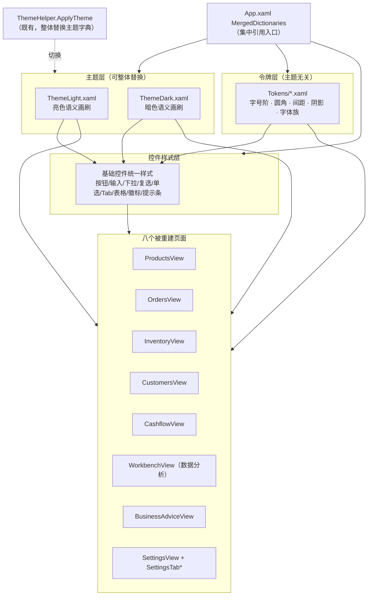
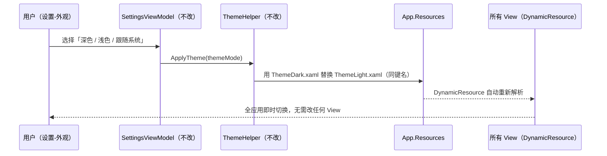
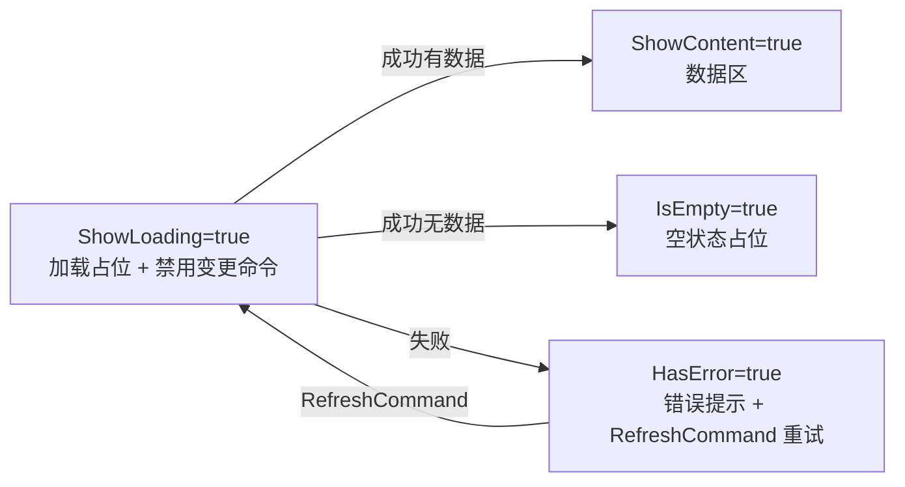
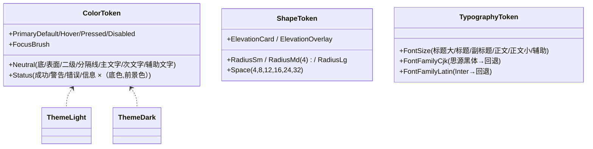

# 设计文档

## Overview

> 概述

本设计描述 Orderly PC 端经营管理系统 **View 层视觉重建** 的技术方案。目标是在**不修改任何 ViewModel、后端、外壳、登录与我的页**的前提下：

1. 建立一套统一、可主题切换（亮/暗双套）的视觉 token 体系，集中承载颜色、字体、字号阶、圆角、间距、阴影与控件状态色；
2. 基于该 token 体系重建八个主页面（成交销售、订单、库存、客户、现金流、数据分析、经营建议、设置）的外观与基础交互。

### 视觉定调（已确认）

| 维度 | 取值 |
| --- | --- |
| 风格方向 | 克制商务高效：信息密度高、装饰极少、强调可扫读 |
| 主色 | 墨蓝 |
| 字体配对 | 中文族「思源黑体」/ 英文数字族「Inter」（含回退） |
| 基础圆角 | 4 像素（三档：小/基础/大） |
| 间距尺度 | 标准档，4 像素基础单位 |
| 状态色 | 默认四态：成功绿、警告黄、错误红、信息蓝 |
| 表格密度 | 舒适档 |
| 主题 | 亮色 + 暗色双 token 一次建齐 |

### 关键设计约束

- **只动 View 与样式资源**：作用范围严格限定为 `src/Orderly.App/Views` 下的指定 View 文件，以及 `src/Orderly.App/Views/Resources` 下的 token 资源文件。
- **零硬编码视觉字面量**：被重建页面不得出现颜色、字号、间距、圆角的字面量，必须全部引用 token。
- **不改 Binding 契约**：所有被重建 View 仅消费 ViewModel 已暴露的属性、命令、集合，不新增、不重命名绑定路径，不在代码后置文件新增逻辑。

### 与现状的关系（调研结论）

调研现有代码后确认了以下既有事实，本设计据此展开：

- **资源合并入口**：`App.xaml` 已合并 `Themes/ThemeLight.xaml` + `App/AppBaseResources.xaml` + `App/AppInputStyles.xaml` + `App/AppButtonStyles.xaml`。
- **主题切换机制已存在**：`Helpers/ThemeHelper.ApplyTheme` 通过在应用资源里**整体替换** `ThemeLight.xaml` ↔ `ThemeDark.xaml` 字典实现亮/暗切换。现有画刷均以 `DynamicResource` 引用，切换可即时生效。这天然满足"通过资源字典替换切换主题、无需改 View"的要求。
- **现有画刷词表**：两套主题已定义 `PrimaryBrush / HeadingBrush / SecondaryTextBrush / CaptionTextBrush / SurfaceSoftBrush / SurfaceRaisedBrush / PageBackgroundBrush / BorderBrushSoft` 等中性与表面色，以及 `AccentSoft+AccentText`（绿）、`WarmSoft+WarmText`（黄）、`BlueSoft+BlueText`（蓝）、`DangerSoft+DangerText`（红）等"底色+前景色"成对的状态色。**当前主色为绿色（`#2B7A5C`），本次需改为墨蓝。**
- **页面 Binding 契约高度统一**：七个业务页 VM 均继承 `CommercePageViewModel` 基类，统一暴露 `ShowLoading / HasError / ErrorMessage / IsEmpty / ShowContent` 状态与 `RefreshCommand`（即重试命令），并各自暴露一个 `ObservableCollection<*Row>` 数据集合。设置页由 `SettingsViewModel` + `MainViewModel` 设置分部承载。
- **既有 `DesignTokens.xaml`**：当前是"设置页与我的页精装专用"令牌字典，圆角为 8/12/16，与本次"基础圆角 4"的全局要求不一致，且被 **我的页（范围外）** 消费，不能破坏。

---

## Architecture

> 架构

### 分层结构

本次重建在表现层内部建立"令牌 → 样式 → 页面"三层依赖，单向向上引用，互不反向依赖：

### 主题切换数据流

### 令牌词表组织策略（核心设计决策）

要在"建立全局基础圆角 4px"与"不破坏我的页所依赖的现有 `DesignTokens.xaml`（圆角 8/12/16）"之间取得平衡，采用如下分工：

- **语义画刷（颜色）**：复用现有主题画刷键名（`PrimaryBrush`、`HeadingBrush`、状态四态的 `*Soft`/`*Text` 等）。这些键已在两套主题中以 `DynamicResource` 全应用通行，**只需在主题文件中把主色由绿改为墨蓝并补齐缺失的分级/中性级**，即可让八个页面统一着色，且无需新建一套并行颜色键造成割裂。
- **非颜色令牌（字号/圆角/间距/阴影/字体族）**：在 `Views/Resources/Tokens/` 下新建一组**全新键名**的规范令牌字典（采用统一前缀，见下），在 `App.xaml` 集中合并，供八个页面引用。新键名与既有 `DesignTokens.xaml` 的 `Radius*/Space*/Type*` **不冲突**（既有键名继续供我的页消费），从而实现 4px 基础圆角而不破坏范围外页面。
- **共存与未来收敛**：本次新令牌与既有 `DesignTokens.xaml` 暂时共存；待我的页未来纳入重建范围后，可将两者收敛为单一来源。该共存关系在设计中显式记录，避免误判为重复定义。

> 命名约定（新令牌，避免与既有键冲突）：颜色沿用既有语义画刷键；圆角 `UiRadius{Sm|Md|Lg}`；间距 `UiSpace{Xxs..Xxl}`；字号 `UiFont{Display|Title|Subtitle|Body|BodySm|Caption}`；阴影 `UiElevation{Card|Overlay}`；字体族 `UiFontFamilyCjk` / `UiFontFamilyLatin`；焦点边框 `UiFocusBrush`。最终前缀以实现阶段统一确定，但必须满足"不与既有键碰撞"这一约束。

---

## Components and Interfaces

> 组件与接口

### 1. 令牌资源文件集（新增）

位于 `src/Orderly.App/Views/Resources/Tokens/`，在 `App.xaml` 的 `MergedDictionaries` 中集中引用：

| 文件 | 职责 |
| --- | --- |
| `Tokens/Typography.xaml` | 字号阶（≥6 级）、字重、中文/英文数字字体族与回退顺序 |
| `Tokens/Shape.xaml` | 圆角（小/基础 4px/大）、间距阶（4/8/12/16/24/32）、阴影（弱/强） |
| `Controls/ControlStyles.xaml` | 按钮、输入框、下拉、复选、单选、Tab、表格、徽标、提示条的统一样式（隐式样式或具名 Style） |
| `Controls/StatePresenters.xaml` | 空状态、加载占位（骨架/加载条）、错误提示、行级校验错误、状态徽标等可复用呈现模板 |

> 主题文件 `Themes/ThemeLight.xaml` / `Themes/ThemeDark.xaml` 在原位扩展（补齐墨蓝主色分级、中性七级、状态四态前景/底色对、焦点色），保持既有键名与 `ThemeHelper` 的替换契约不变。

### 2. 主色与状态色（语义画刷）

主色改为墨蓝，提供"默认/悬停/按下/禁用"四级；中性色覆盖底背景、表面、二级背景、分隔线、主文字、次文字、辅助文字共七级；状态四态每态含"底色 + 可读前景色"两个画刷。

| 语义 | 亮色（示意） | 暗色（示意） | 用途 |
| --- | --- | --- | --- |
| 主色 默认/悬停/按下/禁用 | 墨蓝系分级 | 墨蓝系分级 | 主按钮、选中态、焦点 |
| 成功 底/前景 | 绿系 | 绿系 | 已完成、净流入、正常 |
| 警告 底/前景 | 黄系 | 黄系 | 需关注、低库存预警 |
| 错误 底/前景 | 红系 | 红系 | 异常、逾期、净流出、校验失败 |
| 信息 底/前景 | 蓝系 | 蓝系 | 待处理、提示 |

> 具体色值在实现阶段确定，但必须通过需求 12 的对比度门槛（正文与背景、徽标前景与底色均 ≥ 4.5:1）。

### 3. 基础控件统一样式

为按钮、输入框、下拉、复选、单选、Tab、表格、徽标、提示条提供统一样式：

- **按钮**：主/次/文本三类，使用主色分级表达悬停/按下/禁用；统一圆角与内边距。
- **表格（DataGrid/ListView）**：舒适档行高与内边距；选中态使用主色弱底 + 左侧主色条等可扫读视觉；启用 UI 虚拟化。
- **状态徽标**：胶囊形，使用状态四态的"底+前景"组合；同时承载文字，确保不以颜色为唯一信息载体。
- **提示条 / 行级错误**：错误态使用错误色，含图标 + 文案。
- **焦点边框**：所有可获焦控件具备明确焦点边框，颜色取自 `UiFocusBrush`。

### 4. 八个被重建页面（View）

所有页面遵循统一的"状态机式"布局骨架，复用各页 VM 已暴露的统一状态契约：

各页面差异点（均只消费既有绑定，不新增路径）：

| 页面 | 文件 | DataContext | 关键绑定（既有） | 视觉要点 |
| --- | --- | --- | --- | --- |
| 成交销售 | `Sections/ProductsView.xaml` | `ProductsPage` | `Products` 集合、`RefreshCommand`、状态四标志 | 顶部概况区 + 主体成交列表；选中态高亮 |
| 订单 | `Sections/OrdersView.xaml` | `OrdersPage` | `Orders` 集合、`SalesStage/PaymentStage/FulfillmentStage` | 顶部筛选/搜索区 + 列表；订单状态以状态色徽标着色 |
| 库存 | `Sections/InventoryView.xaml` | `InventoryPage` | `Items` 集合、`IsLowStock`、`ShouldReorder` | 列表；命中预警行用警告/错误色高亮 |
| 客户 | `Sections/CustomersView.xaml` | `CustomersPage` | `Customers` 集合、`RecencyDays/Frequency/Monetary` | 顶部搜索/筛选 + 列表；跟进/异常以状态色徽标 |
| 现金流 | `Sections/CashflowView.xaml` | `CashflowPage` | `RealizedIncome/RealizedExpense/NetCashFlow`、`Entries`、`HealthScore` | 顶部收入/支出/净额三数字（数字字号阶）；净流入绿/净流出红；明细列表 |
| 数据分析 | `Sections/WorkbenchView.xaml` | `WorkbenchPage` | `TotalOrders/TotalRevenue/...`、`Trend` | 指标卡阵列；异常指标用状态色标注 |
| 经营建议 | `Sections/BusinessAdviceView.xaml` | `BusinessAdvicePage` | `Insights` 集合、`Severity/Title/Message/Category` | 建议卡片列表；按 `Severity` 状态色分级；既有命令绑定到卡片按钮 |
| 设置 | `Sections/SettingsView.xaml` + `SettingsTab*.xaml` | `SettingsViewModel`/`MainViewModel` 设置分部 | 各 `*Input` 属性、命令、选项集合 | 保留 Tab 结构；统一"标签-控件-说明"三段式行；当前 Tab 高亮；禁用态与行级错误用 token 呈现 |

> 现金流"图表占位"：仅当 VM 已暴露图表相关属性/集合时在概览区下方预留占位区并绑定；当前 `CashflowPageViewModel` 仅暴露汇总数字与 `Entries`，未暴露图表数据，故**不引入新的图表数据来源**（满足 6.8 的条件分支）。

### 5. 资源引用方式（不改外壳）

被重建的 `UserControl` 在自身 `UserControl.Resources` 中按需合并样式字典；颜色与基础令牌经 `App.xaml` 全局合并提供。`MainWindow`、`NavigationSidebar` 等外壳文件不动。

---

## Data Models

> 数据模型

本特性为 View 层视觉重建，**不引入新的运行时数据模型、不新增 ViewModel 字段、不改后端 Schema**。这里的"数据模型"指**令牌的逻辑结构**与**页面消费的既有只读投影**。

### 令牌逻辑模型

**亮暗一致性**：`ThemeLight.xaml` 与 `ThemeDark.xaml` 以**同一组键名一一对应**，是满足"主题字典整体替换即可切换"的结构前提。

### 页面消费的既有只读投影（节选，均来自现有 VM，不新增）

| 投影记录 | 字段 | 视觉用途 |
| --- | --- | --- |
| `OrderRow` | `SalesStage / PaymentStage / FulfillmentStage / Total / ReceivableAmount` | 状态徽标着色、金额展示 |
| `InventoryRow` | `IsLowStock / ShouldReorder / QuantityAvailable / ReorderThreshold` | 预警行高亮 |
| `CashFlowRow` | `Direction / Amount / SettlementStatus / OccurredAt` | 收支方向着色、明细行 |
| `BusinessInsightRow` | `Severity / Title / Message / Category` | 卡片分级标注 |
| `CustomerRow` | `RecencyDays / Frequency / Monetary` | 客户列表展示 |
| `WorkbenchTrendRow` + 指标属性 | `TotalRevenue / GrossProfit / Trend ...` | 指标卡数值 |

---

## Error Handling

> 错误处理

本特性的"错误"主要发生在**资源解析**与**页面状态呈现**两个层面，均不涉及业务逻辑。

### 1. 页面级业务错误（复用既有契约，仅做视觉呈现）

- 各业务页 VM 基类 `CommercePageViewModel` 已将服务失败转化为 `HasError + ErrorMessage`，并保留上次有效状态、不终止应用。
- View 仅负责呈现：`HasError=true` 时显示错误区，绑定 `ErrorMessage`；**当 VM 暴露重试命令（`RefreshCommand`）时绑定该命令**，否则仅显示文案、不新增命令通道。当前所有业务页基类均提供 `RefreshCommand`，故统一绑定重试按钮。
- 设置页行级校验错误：仅基于 VM 已暴露的错误字段，用错误状态色显示行级提示，**不新增校验逻辑**。

### 2. 资源解析与降级

- **令牌缺失/拼写错误**：使用 `DynamicResource` 引用语义画刷，若键缺失会回退为透明/默认，视觉异常但不崩溃。实现阶段以"令牌键齐备性测试"防止缺键（见测试策略）。
- **字体缺失**：中文/英文字体族均配置回退链（思源黑体→系统中文字体；Inter→系统英文字体），缺字体时自动回退而非报错。
- **主题切换异常**：`ThemeHelper` 已对注册表读取等做 try/catch 兜底（默认浅色），本次不改其逻辑。

### 3. 契约破坏防护（交付门禁）

- 任何被重建 View 若出现硬编码视觉字面量、或触发命令的方式与既有 Binding 契约不一致、或在代码后置文件新增"事件转命令/状态计算"逻辑，均视为不达标、拒绝交付（需求 1.12、10.5、10.6）。
- 通过审查 + 自动化扫描双重防护（见测试策略）。

---

## Testing Strategy

> 测试策略

### 为什么不采用基于属性的测试（PBT）

本特性是 **WPF View 层 / XAML 视觉重建 + 设计令牌（资源配置）**，属于 UI 渲染与配置资源类工作，没有"对任意生成输入计算输出"的纯函数逻辑可供普遍量化验证。按照工作流对 PBT 适用性的判定，UI 渲染/布局与配置校验**不适用 PBT**，故本设计**不设 Correctness Properties 章节**，改用下述更贴合的验证手段。其中"对比度达标""亮暗键名一一对应"等虽具规则性，但作用于**有限且固定的令牌集合**，本质是枚举校验而非随机输入属性，故归入示例/枚举型自动化测试。

### 验证手段组合

| 类别 | 手段 | 覆盖的需求 |
| --- | --- | --- |
| 令牌键齐备性（枚举测试） | 校验所有要求的颜色/字号/圆角/间距/阴影/状态色令牌键存在 | 1.2–1.8、1.11 |
| 亮暗一致性（枚举测试） | 校验 `ThemeLight` 与 `ThemeDark` 键集合完全一致（一一对应） | 1.9 |
| 对比度门槛（枚举计算测试） | 对正文/背景、徽标前景/底色逐对计算对比度 ≥ 4.5:1 | 12.1、12.2 |
| 硬编码扫描（静态检查） | 扫描八个被重建 XAML，断言不含颜色/字号/间距/圆角字面量 | 1.12、各页 .1 |
| Binding 契约核验（静态/审查） | 比对重建前后 View 引用的属性/命令/集合集合无新增、无重命名；代码后置无新增逻辑 | 2–9 各 .2、10.4、10.5、10.6 |
| 范围隔离核验（静态检查） | 确认 ViewModels/Core/Data/Infrastructure/cloudfunctions 及外围 View（含我的页）未被改动 | 10.1–10.3、13.1–13.6 |
| 字号下限（枚举测试/审查） | 正文 ≥ 13px、辅助说明 ≥ 12px | 12.5 |
| 虚拟化与冒烟（运行时/手动） | 列表页启用 UI 虚拟化；冷启动 ≤ 3s、切页首屏 ≤ 300ms、1000 行滚动 ≥ 50FPS | 11.1–11.5、12.3、12.4 |
| 构建验证 | `dotnet build` 全解决方案通过；八页与设置子 Tab 可正常加载渲染 | 全局 |

### 测试与验收要点

- **单元/枚举测试**：聚焦令牌齐备性、亮暗一致性、对比度计算与硬编码扫描——这些是可自动断言的确定性检查。
- **手动/可视化验收**：键盘 Tab 焦点边框、空/加载/错误/选中四态外观、暗色切换、性能基线，需在基准设备（4 核/8GB、Win10/11、60Hz）人工核验，并辅以截图回归。
- **完整可达性结论**：颜色对比可自动计算，但 WCAG 全量符合性仍需结合辅助技术人工测试与专家评审，本设计仅保证对比度与焦点可见性的工程门槛。

### 验收清单（交付前自检）

1. 八个页面与设置子 Tab 全部使用 token，零硬编码视觉字面量。
2. 亮/暗主题键名一一对应，切换无需改 View，`ThemeHelper` 替换路径生效。
3. 正文及徽标对比度 ≥ 4.5:1；正文字号 ≥ 13px、辅助 ≥ 12px。
4. 所有列表页启用 UI 虚拟化；性能基线达标。
5. ViewModels/后端/外壳/登录/我的页/各对话框未被改动，Binding 契约零变更。
6. `dotnet build` 通过，应用可冷启动并交互。

---

## 设计决策与理由（小结）

1. **复用既有语义画刷键而非另建一套颜色键**：避免颜色词表割裂，主色改墨蓝只需改主题文件键值，且天然继承 `DynamicResource` + `ThemeHelper` 的即时切换能力。
2. **非颜色令牌另起新键名（4px 基础圆角）**：与我的页仍依赖的既有 `DesignTokens.xaml`（圆角 8/12/16）解耦，既满足全局 4px 要求又不破坏范围外页面；记录共存关系与未来收敛路径。
3. **页面统一状态机骨架**：七业务页 VM 已统一暴露 `ShowLoading/IsEmpty/HasError/ShowContent/RefreshCommand`，View 据此用同一套占位/错误/空/选中视觉模板，降低重复并保证一致性。
4. **不引入图表/组件/动画库与国际化**：严格遵守交付边界（需求 13），现金流图表仅在 VM 已暴露数据时占位绑定。
