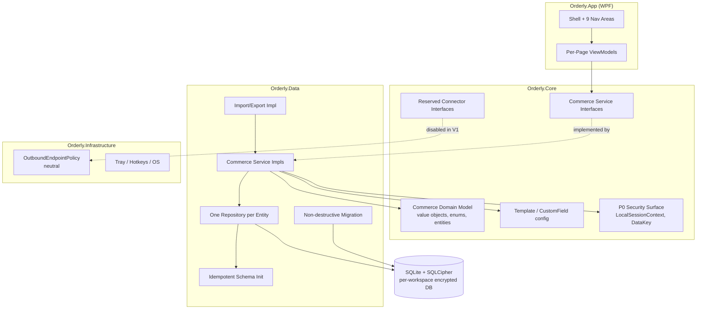
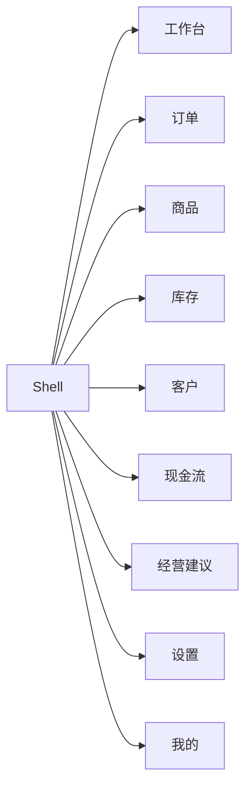
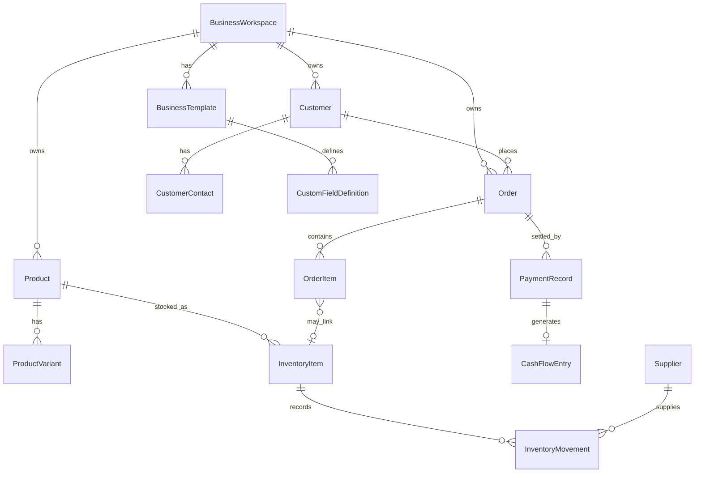

# Design Document

## Overview

This design transforms Orderly from a customer-specific, industry-specific WPF application into a fully generic, **local-first PC commerce and operations system** for small business owners. The target positioning is:

> **Orderly = a local-first PC application combining deal/sales, orders, inventory, customers, cash flow, data analytics, and business advice for small business owners.**

The transformation introduces an industry-agnostic **Universal Domain Model** (`Orderly.Core/Commerce`), a stable **Commerce Service Layer**, a SQLite/SQLCipher **data layer** with one table/repository per entity, a JSON-based **Business Template / customization system**, a restructured WPF UI with nine top-level navigation areas, generic **import/export**, neutral **demo/QA data**, and a **forbidden-terms regression test**. All legacy customer-specific logic, the remote business gateway, legacy state machines, and legacy projections are removed from the Main_Line.

Two non-negotiable boundaries shape every decision:

1. **P0 Security Preservation (C-2 / Requirement 15)** — The completed P0_Security_System (SQLCipher full-database encryption, local account system, launcher DB, multi-account structure, DPAPI key protection, field-level encryption, backup/restore, security audit, `LocalSessionContext`/`DataKey`) MUST be preserved with zero test regressions. Where any transformation step conflicts with P0 behavior, P0 behavior wins.
2. **Forbidden Terms (C-4)** — No Forbidden_Term may appear anywhere in the Main_Line (`src/`, `tests/`, `tools/`, `README.md`, `docs/`). A runtime regression test enforces this.

### Scope Decision: Full Universal System in V1

Per the user's explicit selection of **"Full C-1 override per requirements.md"**, the **complete universal-commerce system is in V1 design scope** — not a Workbench-only delivery. All nine top-level navigation areas are part of the target V1 design: 工作台 / 订单 / 商品 / 库存 / 客户 / 现金流 / 经营建议 / 设置 / 我的. The design covers the full universal model across every area, and implementation MAY still be sequenced into ordered task phases, but those tasks MUST cover the complete universal system rather than delivering the Workbench alone.

Per the user's explicit confirmation of **constraint C-1 (AGENTS.md Closed-Area Override)** and **Requirement 6.11**, the Login Page, Settings Page, Order Fulfillment Page, Order Fulfillment backend fields, and Exception Handling Page **are in scope** for this restructure and may be modified, refactored, or replaced to achieve the universal model. Login, Settings, Order Fulfillment, the backend fulfillment fields, and Exception Handling are included in V1 wherever the universal model requires them. P0 security behavior (P0_Security_System, C-2) still takes precedence wherever any transformation step conflicts with it.

### Out of Scope

`miniprogram/` and `cloudfunctions/` are explicitly out of scope (C-3) and MUST NOT be touched. Real user local data MUST NOT be deleted (C-6).

### Design Goals

- Industry-agnostic core: no top-level field, type, class, file, or UI string carries any Forbidden_Term.
- Personalization without schema change: per-entity `CustomFieldsJson`.
- Independent three-dimensional order stages (sales / payment / fulfillment).
- All core writes are atomic and idempotent by Business_Key.
- Deterministic, local-only insights (no LLM in the main line).
- Connectors reserved but disabled by default in V1.

## Architecture

### Layered Architecture

The solution keeps its existing four-project layering and adds a `Commerce` namespace family plus a `tests/Orderly.Tests` project.



### Key Architectural Decisions

| Decision | Rationale |
|---|---|
| Keep 4-project layout (`App`, `Core`, `Data`, `Infrastructure`) | Minimizes structural churn; P0 security already lives across `Core`/`Data` and must be preserved. |
| New `Orderly.Core/Commerce` namespace for the domain model | Isolates the universal model; keeps Forbidden_Term-free naming auditable in one place. |
| Service interfaces in `Core`, implementations in `Data` | UI and tests depend only on stable interfaces; persistence detail stays in `Data`. |
| `CustomFieldsJson` string column on every entity | Personalization without industry-specific schema changes (Req 2.4). |
| Three independent order stage enums | Sales, payment, and fulfillment evolve independently (Req 4.3). |
| Single `Core_Write_Transaction` per core write | All-or-nothing semantics (Req 18). |
| Idempotency keyed by `Business_Key` | Re-running completion/payment never duplicates financial/inventory/insight records (Req 4.20, 18.6). |
| Deterministic local insight rules + reserved `IBusinessInsightProvider` | No LLM dependency; future extensibility (Req 4.14, 4.15). |
| Connectors declared but disabled | Local-first guarantee in V1 (Req 8). |

### Workspace and Database Topology

Each `BusinessWorkspace` maps to one SQLCipher-encrypted SQLite database stored under `%LocalAppData%\Orderly` (Req 1.5). The launcher database and multi-account structure from the P0_Security_System are preserved unchanged. Schema initialization is idempotent: running it repeatedly leaves an identical final schema (Req 3.3).

### Forbidden-Term Containment Strategy

The forbidden-term *definitions* exist only inside `ForbiddenTermsRegressionTests`, constructed at runtime by concatenating fragments so the test source never literally contains a term (Req 11.8). No definition is copied into `docs/`, `README.md`, `src/`, `tests/`, or `tools/`. Legacy services such as `IStringNarrationBusinessService`, `IStringNarrationOrderService`, `IDealService`, and the gateway clients are removed or replaced by neutral Commerce services.

## Components and Interfaces

### Commerce Service Layer (Orderly.Core/Commerce/Services)

All fifteen interfaces from Requirement 4.1 are defined in `Core` and implemented in `Data`. Every method returns a result type that distinguishes success from a typed failure (see Error Handling).

```csharp
public interface IWorkspaceService { /* CRUD over BusinessWorkspace */ }
public interface IBusinessTemplateService { /* create/edit/activate/clone/import/export via JSON */ }
public interface ICustomFieldService { /* CustomFieldDefinition per entity type, 0..100 */ }
public interface IUnitService { /* UnitDefinition management */ }
public interface IProductService { /* Product / ProductVariant CRUD */ }
public interface IInventoryService { /* movements, low-stock, usage, CoverageDays, reorder */ }
public interface ICustomerService { /* customers, RFM metrics, repurchase reminders */ }
public interface IOrderService { /* order calc, 3-dim stages, completion + deduction */ }
public interface IPaymentService { /* PaymentRecord, at most one CashFlowEntry */ }
public interface ICashFlowService { /* income/expense/receivable/payable, health score */ }
public interface ISupplierService { /* Supplier CRUD */ }
public interface IBusinessTaskService { /* BusinessTask CRUD + status */ }
public interface IDashboardService { /* DashboardSnapshot: metrics + 7-day trends */ }
public interface IBusinessInsightService { /* deterministic local rules, reserved provider hook */ }
public interface IImportExportService { /* CSV/XLSX import/export with preview */ }
```

#### IOrderService (core behaviors)

- **Recalculation** (Req 4.2): on create/update, recompute subtotal, total, cost, gross profit, paid amount, receivable — each money value rounded to 2 dp; gross margin as a percentage in [0, 100] rounded to 2 dp.
- **Independent stages** (Req 4.3): payment actions never force a sales/fulfillment change, and vice versa.
- **Workflow-validated transitions** (Req 4.4, 4.5): a transition is applied only to the dimension(s) it names, and only if the active template's workflow permits it; otherwise all three dimensions remain unchanged and an error result is returned.
- **Completion** (Req 4.6, 4.7, 4.16, 4.17, 18.2, 18.4): aggregate required quantity per `InventoryItemId` across all inventory-linked OrderItems; if every aggregate ≤ `QuantityAvailable`, apply exactly one deduction per `InventoryItemId` and update customer statistics inside the `Core_Write_Transaction`; otherwise reject and roll back entirely. OrderItems not linked to an InventoryItem never block completion and incur no deduction.
- **Idempotent financials** (Req 4.19, 18.5): if a PaymentRecord/CashFlowEntry already exists for the order, reuse it; create none extra.

#### IInventoryService (metrics)

- Low-stock = available ≤ reorder threshold (Req 4.9).
- Average daily usage over fixed 7-day and 30-day windows.
- `CoverageDays = QuantityAvailable / AvgDailyUsage30d`, **null when `AvgDailyUsage30d == 0`** (Req 4.10).
- Reorder suggestion + inventory insights.

#### ICustomerService (RFM)

- Recency = days since last completed order; Frequency = count of completed orders; Monetary = summed total of completed orders; plus repurchase reminders (Req 4.11).

#### ICashFlowService

- Records income/expense/receivable/payable; settles receivable/payable; period summaries; cash-flow health score as an integer in [0, 100] (Req 4.12).
- `CashFlowDirection` is one of `Income`, `Expense`, or `Transfer`. `Transfer` records neutral movement of funds between accounts (account-to-account / internal fund movement) and is net-zero with respect to business income/expense. Receivable and payable are represented through `CashFlowSettlementStatus` and due dates on income/expense entries — never by removing or repurposing `Transfer`.

#### IBusinessInsightService

- Generates insights from deterministic local rules only; never calls an LLM (Req 4.14).
- Exposes reserved `IBusinessInsightProvider` extension point (Req 4.15).

### Reserved Connector Interfaces (Orderly.Core/Commerce/Connectors)

`IExternalConnector`, `IExternalOrderConnector`, `IExternalInventoryConnector`, `ConnectorOptions`, `ConnectorHealthStatus` are declared but not wired to any runtime implementation in V1 (Req 8.3). All connectors report `disabled` health on startup (Req 8.6); invoking a disabled connector performs no outbound request, preserves local data, and returns a "connector disabled" result (Req 8.5).

### WPF UI Shell and Navigation (Orderly.App)

Nine persistent top-level navigation entries, in this exact order. The **user-visible rendered labels are Chinese only** (Req 6.1, 17.3) and are all visible without scrolling at default window size:

`工作台`, `订单`, `商品`, `库存`, `客户`, `现金流`, `经营建议`, `设置`, `我的`.

The actual UI never renders a combined label such as "工作台 (Workbench)"; only the Chinese label is shown to the user. The English names below (Workbench / Orders / Products / Inventory / Customers / Cash Flow / Business Advice / Settings / Me) are **developer-only annotations** used in code, ViewModel names, design prose, and developer documentation — they MUST NOT appear in the rendered UI:

| Rendered label (UI) | Developer-only name (code / ViewModel / docs) |
|---|---|
| `工作台` | Workbench |
| `订单` | Orders |
| `商品` | Products |
| `库存` | Inventory |
| `客户` | Customers |
| `现金流` | Cash Flow |
| `经营建议` | Business Advice |
| `设置` | Settings |
| `我的` | Me / Account |



> Diagram and table note: the bracketed/right-column English terms are developer-only annotations for traceability; the WPF navigation control binds to and renders the Chinese labels only.

- Selecting an entry shows its page within 1s and marks it active (Req 6.12).
- Each page sources data from its corresponding Commerce service within 2s under normal local conditions (Req 6.2–6.8).
- Service error → page-level error indication, navigation state retained, no app termination (Req 6.13).
- Empty data set → explicit empty-state indication (Req 6.14).
- The V1 design scope is the **full universal-commerce system**: all nine navigation areas are designed and delivered, not a Workbench-only subset. Per the C-1 override, the previously closed surfaces (Login, Settings, Order Fulfillment, Exception Handling) are in scope and re-sourced through the Commerce Service Layer. Implementation may be ordered into task phases, but the tasks cover the complete universal system. P0 security behavior surfaced by the Login/account flow is preserved and takes precedence (C-2).

### ViewModel Structure (Orderly.App/ViewModels)

- Exactly one dedicated ViewModel (or one clearly delimited region within a single partial) per page; no ViewModel/partial aggregates more than one page (Req 7.1).
- No `MainViewModel` partial file exceeds 500 LOC (Req 7.2).
- ViewModels obtain business data only through the Commerce Service Layer; no direct legacy remote calls (Req 7.3, 7.4).
- Service failure → surface error, retain last known valid state, no legacy fallback (Req 7.5).
- Every data-bound control binds only to its page ViewModel; no binding targets a legacy aggregation property (Req 7.7).

### Import/Export (IImportExportService)

CSV and XLSX for products, inventory, customers, orders, cash flow. Import flow: validate → preview → commit valid rows only → report per-row failures → roll back on commit-level error. All logic lives inside the Import_Export_Service (Req 9).

**Deterministic match keys** decide whether an incoming row is a new record or an update to an existing one. Matching is resolved per entity in priority order:

| Entity | Match key (in priority order) |
|---|---|
| `Product` | `Code` first; if `Code` is empty, fall back to `Name`. |
| `InventoryItem` | `Sku` first; if `Sku` is empty, fall back to `Name`. |
| `Customer` | `Phone` first; then `WeChat`; then `Name`. |
| `Order` | `OrderNo`. |
| `CashFlowEntry` | `ImportBatchId` + `SourceRowKey` (a stable per-row business key); if unavailable, another stable business key designated for the batch. |

**Row classification** — preview classifies every row as exactly one of:

- **Add** — no existing record matches the primary or fallback key.
- **Update** — exactly one existing record matches deterministically (primary key, or fallback key when the primary key is empty).
- **Error** — the row fails schema/validation (bad file, missing required columns, invalid values).
- **Conflict** — the match is ambiguous: a fallback key (e.g., `Name`) matches more than one existing record, or multiple candidate keys resolve to different records. Ambiguous fallback matches are classified as **Conflict** and are NOT silently updated.

Preview reports per-row counts and the classification of each row (Add / Update / Error / Conflict). Commit applies only `Add` and `Update` rows; `Error` and `Conflict` rows are reported with a reason and never written.

**Idempotent commit** — because matching is deterministic by the keys above, re-importing the same file produces no duplicate records: previously-added rows resolve to `Update` (or no-op) on the second run rather than inserting new records. A commit-level error rolls back to the pre-commit state (Req 9.7).

## Data Models

### Value Objects and Enums (Req 2.1)

At minimum these 14 industry-agnostic types in `Orderly.Core/Commerce`:

| Type | Responsibility |
|---|---|
| `CommerceMoney` | Decimal money, range −999,999,999.99…999,999,999.99, scale exactly 2 (Req 2.6). |
| `DateRange` | Start/end date window. |
| `EntityLifecycleStatus` | Active / archived / deleted lifecycle. |
| `BusinessEntityType` | Enumerates entity types (for custom fields, templates). |
| `CustomFieldDataType` | Data type of a custom field. |
| `OrderSalesStage` | Sales dimension stage. |
| `OrderPaymentStage` | Payment dimension stage. |
| `OrderFulfillmentStage` | Fulfillment dimension stage. |
| `CashFlowDirection` | Income / Expense / Transfer. `Transfer` represents neutral account-to-account or internal fund movement; receivable/payable are NOT directions and are represented via settlement status + due dates. |
| `CashFlowSettlementStatus` | Settlement state and due dates for receivable/payable entries. |
| `InventoryMovementType` | Inbound / outbound / adjustment movement classification. |
| `ProductType` | Product classification (physical / service / etc.). |
| `TaskStatus` | Business task status. |
| `InsightSeverity` | Severity of a generated insight. |

Additional neutral helper value objects, DTOs, result/paging/validation/transaction objects are permitted as long as they are industry-agnostic and Forbidden_Term-free.

### Entities (Req 2.2)

At minimum these 18 entities in `Orderly.Core/Commerce`:

`BusinessWorkspace`, `BusinessTemplate`, `CustomFieldDefinition`, `UnitDefinition`, `Product`, `ProductVariant`, `InventoryItem`, `InventoryMovement`, `Customer`, `CustomerContact`, `Order`, `OrderItem`, `PaymentRecord`, `CashFlowEntry`, `Supplier`, `BusinessTask`, `BusinessInsight`, `BusinessMetricSnapshot`.



### Common Entity Shape

Entities split into **workspace-scoped business entities** and **non-scoped system/config entities**. Only the former carry a `WorkspaceId`; `BusinessWorkspace` itself and the system/template/config entities do not carry a `WorkspaceId` (Req 2.7, 2.8, 2.9).

All entities share the common audit/lifecycle/personalization fields via a shared base:

```csharp
public abstract class CommerceEntity
{
    public Guid Id { get; init; }
    public DateTime CreatedAt { get; init; }        // UTC, non-null, never changes after creation
    public DateTime UpdatedAt { get; private set; } // UTC, non-null, set on every persisted-field change
    public DateTime? DeletedAt { get; private set; } // UTC, nullable
    public EntityLifecycleStatus Lifecycle { get; private set; }
    public string? CustomFieldsJson { get; set; }   // single personalization field (Req 2.4, 2.5)
}

// Business data entities are workspace-scoped: they belong to exactly one BusinessWorkspace.
public abstract class WorkspaceScopedEntity : CommerceEntity
{
    public Guid WorkspaceId { get; init; }          // non-null owning workspace
}

// System / aggregate-root entities are NOT workspace-scoped and carry no WorkspaceId.
// BusinessWorkspace is the scoping root itself and therefore cannot reference a WorkspaceId.
public abstract class SystemEntity : CommerceEntity { }
```

**Workspace-scoped entities** (extend `WorkspaceScopedEntity`, carry a non-null `WorkspaceId`):
`Product`, `ProductVariant`, `InventoryItem`, `InventoryMovement`, `Customer`, `CustomerContact`, `Order`, `OrderItem`, `PaymentRecord`, `CashFlowEntry`, `Supplier`, `BusinessTask`, `BusinessInsight`, `BusinessMetricSnapshot`.

**Non-scoped / system entities**:

| Entity | Scoping role |
|---|---|
| `BusinessWorkspace` | The scoping root. Extends `SystemEntity`. Does **not** carry a `WorkspaceId` (it *is* the workspace). |
| `BusinessTemplate` | May be **built-in/system** (the single built-in `DefaultCommerce`, no `WorkspaceId`) or **workspace-scoped** (a user-created/cloned template owned by one workspace, with a nullable `WorkspaceId` that is null for the built-in and set for workspace-owned templates). Documented per-row so each template instance is unambiguously system or workspace-owned. |
| `CustomFieldDefinition` | **Template-scoped**: associated with exactly one `BusinessTemplate` (and through it, optionally a workspace) and exactly one entity type; not directly workspace-scoped, scoped by `TemplateId`. |
| `UnitDefinition` | **Built-in or template-scoped**: built-in units are system-level (no `WorkspaceId`); user-defined units are scoped by `TemplateId` (and, transitively, the owning workspace via that template). |

- The `WorkspaceId` for business data is therefore enforced only on `WorkspaceScopedEntity`; system/config entities use `BuiltIn`/`System`, `TemplateId`, or a nullable `WorkspaceId` depending on their role above.
- `CustomFieldsJson` is stored as provided; the entity does not validate it at assignment time (Req 2.5). Well-formedness is enforced at the service/repository save boundary (Req 3.11, 3.12).
- Soft-delete/archive sets `DeletedAt` + lifecycle status, retains the record, excludes it from active queries, keeps it recoverable (Req 2.9).
- No top-level field name or type identifier contains any Forbidden_Term (Req 2.3).

### Order Stage Model

`Order` holds three independent stage fields — `OrderSalesStage`, `OrderPaymentStage`, `OrderFulfillmentStage` — plus monetary fields (subtotal, total, cost, grossProfit, grossMargin, paidAmount, receivableAmount). Stage transitions are governed by the active template's workflow configuration.

### Data Layer (Orderly.Data)

- One SQLite/SQLCipher table and one repository per entity, each exposing create/read/update/delete (Req 3.2).
- Idempotent schema init (Req 3.3).
- Save boundary validates `CustomFieldsJson`: non-null + malformed JSON → reject with "invalid custom-field content", existing data unchanged (Req 3.11, 3.12).
- Legacy generic CRM migration mapping (Req 3.4): `Customer→Customer`, `Order→Order`, `Deal→Order|BusinessTask|note` (documented rules), `FollowUp→BusinessTask`, `CustomerNote→note`; `ActivityLog` retained unchanged. Legacy customer-specific/industry-specific remote data is not migrated and left untouched (Req 3.5).
- Migration is non-destructive (Req 3.7), idempotent (Req 3.6), backs up the source DB first, and aborts without change if the backup fails (Req 3.8), logging outcome and migrated record count (Req 3.9).

### Business Template (customization)

- JSON import/export for create/edit/activate/clone/import/export (Req 5.1); invalid schema or undefined entity reference → reject with specific error, existing templates unchanged (Req 5.2).
- Exactly one built-in template: internal key `DefaultCommerce`, display name `默认经营模板`; no industry-specific built-in template (Req 5.3). UI shows only the Chinese display name (Req 5.8).
- `CustomFieldDefinition`: associated with exactly one entity type, 0–100 entries per type (Req 5.4).
- Page configuration: metric-card show/hide, table-column show/hide, default sort, default unit, default currency, default order flow; each show/hide resolves to exactly shown or hidden (Req 5.5).
- Workflow configuration: default workflow over the three independent stage dimensions, composite transitions updating 1–3 dimensions, and an initial stage value per dimension (Req 5.6).
- Workspace with no explicitly activated template → `DefaultCommerce` is active (Req 5.7).

### Demo / QA Data (Req 10)

Neutral Simplified Chinese values only: `客户 A`/`客户 B`, `商品 A`/`商品 B`, `库存项 A`/`库存项 B`, `供应商 A`, `订单 001`, `收入分类 A`, `支出分类 A`. At least one record per category (orders, order items, customers, inventory items, inventory movements, income, expense, receivable, payable), at least one low-stock inventory item, at least one generated insight. No Forbidden_Term, no English-style demo values.


## Correctness Properties

*A property is a characteristic or behavior that should hold true across all valid executions of a system — essentially, a formal statement about what the system should do. Properties serve as the bridge between human-readable specifications and machine-verifiable correctness guarantees.*

These properties are derived from the testable acceptance criteria via the prework analysis. Each is universally quantified and is intended to be implemented as a single property-based test (minimum 100 iterations) over generated inputs. Non-PBT criteria (forbidden-terms scan, P0 security preservation, UI timing, end-to-end Core_Flow) are covered by regression, integration, and smoke tests in the Testing Strategy section rather than as properties.

### Property 1: Money values stay in range with scale 2

*For any* decimal value routed through `CommerceMoney`, the resulting monetary value is constrained to the inclusive range −999,999,999.99 … 999,999,999.99 and has a scale of exactly 2 decimal places; values outside the range are rejected rather than silently truncated.

**Validates: Requirements 2.6**

### Property 2: Order recalculation produces 2dp money and bounded gross margin

*For any* generated order with arbitrary order items, costs, and payments, recalculating the order yields subtotal, total, cost, gross profit, paid amount, and receivable amount each as a monetary value with scale exactly 2, and a gross margin percentage that satisfies 0 ≤ grossMargin ≤ 100 rounded to 2 decimal places.

**Validates: Requirements 4.2**

### Property 3: Mutation preserves CreatedAt and advances UpdatedAt

*For any* entity and *any* mutation of a persisted field, the entity's `CreatedAt` is unchanged and its `UpdatedAt` is set to a current UTC time greater than or equal to its previous `UpdatedAt`.

**Validates: Requirements 2.8**

### Property 4: Soft-delete is recoverable and excluded from active queries

*For any* entity, after a soft-delete or archive operation the entity does not appear in active queries, its `DeletedAt` is non-null and its `EntityLifecycleStatus` is the corresponding archived/deleted value, and the entity remains recoverable with its stored data intact.

**Validates: Requirements 2.9**

### Property 5: Schema initialization is idempotent

*For any* repeat count N ≥ 1, running the Commerce schema-initialization routine N times against the same database leaves the schema in a final state identical to running it once, and raises no error.

**Validates: Requirements 3.3**

### Property 6: Migration is idempotent and non-destructive

*For any* generated legacy source dataset, running the migration two or more times produces a target record set identical to running it once with no duplicated migrated records, and every source record remains present and unchanged after migration (with a source backup created before any change is applied).

**Validates: Requirements 3.6, 3.7**

### Property 7: Malformed custom fields are rejected without side effects

*For any* non-null string that is not well-formed JSON, attempting to save an entity carrying that value as `CustomFieldsJson` is rejected with an invalid-custom-field error and leaves all existing persisted data unchanged.

**Validates: Requirements 3.12**

### Property 8: Order stage dimensions are independent

*For any* order and *any* single-dimension stage action permitted by the active workflow, applying that action changes only the targeted dimension and leaves the other two of `OrderSalesStage`, `OrderPaymentStage`, and `OrderFulfillmentStage` unchanged.

**Validates: Requirements 4.3**

### Property 9: Stage transitions honor the active workflow with no partial update

*For any* workflow configuration (in which each of the three stage dimensions has an assigned initial stage) and *any* requested stage transition: if the transition is permitted, only the dimension(s) it names are updated to their target values; if the transition is not permitted, all three stage dimensions remain unchanged and an error result indicating the transition is not permitted is returned.

**Validates: Requirements 4.4, 4.5, 5.6**

### Property 10: Order completion aggregates per InventoryItemId and is all-or-nothing

*For any* order containing inventory-linked and non-linked order items, the required quantity is aggregated per `InventoryItemId` across all inventory-linked order items: if every aggregated quantity is ≤ that item's `QuantityAvailable`, completion applies exactly one deduction per `InventoryItemId` equal to its aggregated quantity (non-linked items neither block completion nor incur deduction) and updates customer statistics within the Core_Write_Transaction; otherwise the completion is rejected, the transaction is rolled back so all inventory quantities and customer statistics are unchanged, and an insufficient-inventory error is returned.

**Validates: Requirements 4.6, 4.7, 4.16, 4.17, 18.4**

### Property 11: CoverageDays is null exactly when 30-day usage is zero

*For any* inventory metrics request, if `AvgDailyUsage30d` is 0 then `CoverageDays` is reported as null (never 0); otherwise `CoverageDays` equals `QuantityAvailable` divided by `AvgDailyUsage30d`.

**Validates: Requirements 4.10**

### Property 12: Cash-flow health score is a bounded integer

*For any* cash-flow dataset, the computed cash-flow health score is an integer satisfying 0 ≤ score ≤ 100.

**Validates: Requirements 4.12**

### Property 13: Each PaymentRecord links to at most one CashFlowEntry

*For any* sequence of payment operations, every resulting `PaymentRecord` is linked to at most one corresponding `CashFlowEntry`.

**Validates: Requirements 4.18**

### Property 14: Core writes are idempotent by Business_Key

*For any* core write operation that generates `PaymentRecord`, `CashFlowEntry`, `InventoryMovement`, `BusinessInsight`, or `BusinessMetricSnapshot` records and for which a Business_Key is defined, executing that operation two or more times produces the same set of generated records as executing it once — re-running a completion or payment reuses the existing records and creates no duplicate financial, inventory, or insight records.

**Validates: Requirements 4.19, 4.20, 18.5, 18.6**

### Property 15: Business template JSON round-trip preserves the template

*For any* valid Business_Template, exporting it to JSON and importing the result produces an equivalent template, preserving page configuration, workflow configuration, and custom-field definitions.

**Validates: Requirements 5.1**

### Property 16: Invalid template imports are rejected without side effects

*For any* JSON payload that fails schema validation or references an undefined Universal_Domain_Model entity type, the import is rejected with an error identifying the specific validation failure and all existing Business_Templates remain unchanged.

**Validates: Requirements 5.2**

### Property 17: Custom-field definitions are bounded and singly-typed

*For any* entity type, between 0 and 100 `CustomFieldDefinition` entries can be configured and each is associated with exactly one entity type; attempting to add a 101st entry for that entity type is rejected.

**Validates: Requirements 5.4**

### Property 18: Import matching is deterministic, preview counts are accurate, and commit is idempotent

*For any* generated import row set mixing new, existing-matching, ambiguous, and invalid rows, the preview classifies each row as exactly one of Add / Update / Error / Conflict using the deterministic per-entity match keys (Product: Code then Name; InventoryItem: Sku then Name; Customer: Phone then WeChat then Name; Order: OrderNo; CashFlowEntry: ImportBatchId + SourceRowKey), where an ambiguous fallback match is classified as Conflict and never silently updated; the reported Add/Update/Error/Conflict counts equal the true partition of the dataset; committing applies only Add and Update rows and leaves pre-existing records not referenced by the import unchanged, reporting each Error/Conflict row with a reason; re-importing the same file commits no duplicate records (idempotent commit); and if a commit-level error occurs the data is restored to its pre-commit state.

**Validates: Requirements 9.4, 9.5, 9.6, 9.7**

### Property 19: Core write operations are atomic

*For any* core business write operation and *any* injected failure at an arbitrary point within its Core_Write_Transaction, the resulting data state equals the pre-operation state, with no partial update.

**Validates: Requirements 18.1, 18.3**

## Error Handling

The Commerce Service Layer uses an explicit, typed **result** strategy rather than throwing exceptions for expected business failures. Every service method returns a result that distinguishes success (with a payload) from a typed failure (with a stable error code, a human-facing Simplified Chinese message, and optional per-item detail). Exceptions are reserved for truly unexpected conditions (programming errors, corrupted state) and are caught at the page boundary so the application never terminates on a recoverable failure.

### Typed Result Model

```csharp
public enum CommerceErrorCode
{
    None = 0,
    ValidationFailed,          // CustomFieldsJson / template schema / row schema
    InvalidCustomFields,       // Req 3.12
    TransitionNotPermitted,    // Req 4.5
    InsufficientInventory,     // Req 4.7
    TemplateImportInvalid,     // Req 5.2
    CustomFieldLimitExceeded,  // Req 5.4
    ImportRejected,            // Req 9.3
    ImportRowConflict,         // Req 9.4 — ambiguous fallback match; row classified Conflict, not updated
    CommitFailedRolledBack,    // Req 9.7 / 18.3
    ConnectorDisabled,         // Req 8.5
    BackupFailedMigrationAborted, // Req 3.8
    ServiceUnavailable,        // Req 6.13 / 7.5
    Conflict                   // optimistic concurrency
}

public sealed class CommerceResult
{
    public bool Succeeded { get; }
    public CommerceErrorCode ErrorCode { get; }
    public string? Message { get; }                 // Simplified Chinese, user-facing
    public IReadOnlyList<RowError> RowErrors { get; } // per-row import failures (Req 9.6)
}

public sealed class CommerceResult<T> : CommerceResult { public T? Value { get; } }
```

`RowError` carries the source row index, the offending column/field, and a localized reason, supporting the per-row failure reporting in Requirement 9.6.

### Transaction Rollback

- Every core business write executes inside a single `Core_Write_Transaction` (Req 18.1). The service layer opens the transaction, performs all reads/writes, and commits only if every step succeeds.
- If any step fails — validation, aggregation, deduction, financial or insight generation, or a persistence error — the transaction is rolled back in full and the method returns a typed failure, leaving all data unchanged (Req 18.3). This is the mechanism behind Properties 10 and 19.
- Idempotency is enforced inside the transaction: before generating a `PaymentRecord`, `CashFlowEntry`, `InventoryMovement`, `BusinessInsight`, or `BusinessMetricSnapshot`, the layer looks up the existing record by Business_Key and links/updates it instead of inserting a duplicate (Req 4.20, 18.6). A rollback therefore never leaves orphaned half-generated records.

### Validation Failures

- **CustomFieldsJson** (Req 3.11, 3.12): at the repository save boundary, a non-null `CustomFieldsJson` is parsed; if it is not well-formed JSON the save is rejected with `InvalidCustomFields` and existing persisted data is left untouched (Property 7). The domain entity itself never rejects the value at assignment time (Req 2.5).
- **Template schema** (Req 5.2): JSON template imports are validated against the template schema and checked for references to undefined Universal_Domain_Model entity types. On failure the import returns `TemplateImportInvalid` with the specific validation reason and the existing template store is unchanged (Property 16).
- **Custom-field limits** (Req 5.4): adding a `CustomFieldDefinition` beyond 100 per entity type returns `CustomFieldLimitExceeded` (Property 17).
- **Stage transitions** (Req 4.5): a transition not permitted by the active workflow returns `TransitionNotPermitted` with all three stage dimensions unchanged (Property 9).
- **Import files** (Req 9.3): a file that is not valid CSV/XLSX or whose columns do not match the target schema is rejected with `ImportRejected` before any data is committed. A row whose deterministic match is ambiguous (a fallback key matching multiple existing records) is classified as **Conflict** and reported with `ImportRowConflict` rather than being silently updated (Req 9.4). A commit-level error after preview returns `CommitFailedRolledBack` with the data restored to its pre-commit state (Req 9.7, Property 18).
- **Migration backup** (Req 3.8): if the pre-migration source backup cannot be created, the migration aborts before any change with `BackupFailedMigrationAborted`, the source is left unmodified, and the failure is recorded in the migration log (Req 3.9).

### Connector-Disabled Results

In V1 every External_Connector is disabled by default (Req 8.4) and reports `disabled` health at startup (Req 8.6). Any attempt to invoke a disabled connector performs no outbound network request, preserves all local data, and returns a `ConnectorDisabled` result rather than throwing (Req 8.5). Outbound endpoint validation continues to flow through the retained neutral `OutboundEndpointPolicy`.

### Page-Level Error Indication Without Termination

- When a Commerce service is unavailable or returns a failure for a displayed page, the WPF UI shows a page-level error indication, retains the current navigation state, and does not terminate the application (Req 6.13). The corresponding ViewModel surfaces the error, retains the last known valid state without partial updates, and never falls back to any legacy remote service (Req 7.5).
- An empty (but successful) result renders an explicit empty-state indication rather than a blank region (Req 6.14).
- Unexpected exceptions are caught at the shell/page boundary, logged through the existing audit infrastructure, and converted into a page-level error indication, keeping the application running.
- P0 security behavior takes precedence: any error-handling path that would conflict with P0_Security_System behavior defers to the P0 behavior (C-2, Req 15.6).

## Testing Strategy

Testing combines **property-based tests** (universal correctness over generated inputs), **example/unit tests** (specific scenarios and edge cases), **integration tests** (end-to-end flows and the preserved P0 security suite), and a dedicated **forbidden-terms regression test**. The `tests/Orderly.Tests` project is added to `Orderly.sln` (Req 11.1) and contains the directories `Commerce`, `Inventory`, `Cashflow`, `Customers`, `Templates`, `Analytics`, and `Regression` (Req 11.2), each of the first six holding at least one executable test (Req 11.3, 11.4).

### Property-Based Testing Plan

- **Library**: a .NET property-based testing library (FsCheck, or CsCheck for idiomatic C#) layered on the existing xUnit runner. Property generators and shrinking come from the library; they are not implemented from scratch.
- **Iterations**: each property test runs a minimum of 100 generated cases.
- **Traceability tag**: each property test is tagged with a comment in the form
  `// Feature: orderly-universal-commerce-system, Property {number}: {property_text}`
  referencing the matching property in the Correctness Properties section.
- **Generators**: custom generators produce arbitrary money decimals (including range boundaries and >2dp), entities with random field values, orders with multiple order items that share and split `InventoryItemId`s plus non-linked items, legacy migration datasets, workflow configurations with assigned initial stages, inventory usage histories (including all-zero 30-day windows), cash-flow datasets, valid templates, malformed/invalid template payloads, malformed `CustomFieldsJson` strings, and mixed valid/invalid import row sets.

Property-to-directory mapping:

| Property | Directory | Focus |
|---|---|---|
| 1 Money range/scale | Commerce | `CommerceMoney` invariant |
| 2 Order recalculation | Commerce | 2dp money, gross margin ∈ [0,100] |
| 3 Audit timestamps | Commerce | CreatedAt fixed, UpdatedAt advances |
| 4 Soft-delete recoverability | Commerce | exclusion from active queries, recovery |
| 5 Schema init idempotence | Commerce | repeated init identical |
| 6 Migration idempotence/non-destructive | Commerce | repeat + source retention |
| 7 Malformed CustomFieldsJson | Commerce | save rejection, data unchanged |
| 8 Independent stage dims | Commerce | single-dimension isolation |
| 9 Workflow-validated transitions | Templates | permitted/denied, no partial update |
| 10 Completion aggregation/rollback | Inventory | per-InventoryItemId deduction, atomic reject |
| 11 CoverageDays null rule | Inventory | null when AvgDailyUsage30d == 0 |
| 12 Cash-flow health bounds | Cashflow | integer ∈ [0,100] |
| 13 Payment→CashFlow cardinality | Cashflow | at most one entry per payment |
| 14 Idempotency by Business_Key | Commerce | no duplicate generated records |
| 15 Template JSON round-trip | Templates | export∘import equivalence |
| 16 Invalid template import | Templates | rejection, store unchanged |
| 17 Custom-field bounds | Templates | 0..100, single entity type |
| 18 Import matching/preview/idempotent commit | Commerce | deterministic match keys, Add/Update/Error/Conflict counts, valid-only commit, idempotent re-import, restore |
| 19 Core-write atomicity | Commerce | injected-failure pre-state equality |

Analytics-directory property coverage is provided by the dashboard/insight aspects of Properties 11–14 (deterministic local metrics and insight generation); additional example tests verify specific insight rules.

### Forbidden-Terms Regression Test

- `ForbiddenTermsRegressionTests` lives in the `Regression` directory and scans every file under `src/`, `tests/`, and `tools/`, plus `README.md` and the `docs/` directory, for each Forbidden_Term (Req 11.5).
- The scan is limited to those locations and explicitly excludes the Kiro spec files (`requirements.md`, `design.md`, `tasks.md` under `.kiro/`), which are not production Main_Line (Req 11.9, C-4).
- Each Forbidden_Term is constructed at runtime by concatenating two or more string fragments, so the test source file itself contains no literal Forbidden_Term and is never reported as an offending location by its own scan (Req 11.8).
- The test passes when zero Forbidden_Terms are present (Req 11.6) and fails otherwise, listing for each occurrence the offending file path and the matched term (Req 11.7). This also backs the build/acceptance scan in Requirements 1.3, 1.8, 2.3, 8.1, 13.2, and 16.7.

### P0 Security Zero-Regression Verification

- The full pre-existing P0_Security_System automated suite (SQLCipher full-database encryption, local account system, launcher DB, multi-account structure, DPAPI key protection, field-level encryption, backup/restore, security audit, `LocalSessionContext`/`DataKey`) is re-run after each transformation step (Req 15.1–15.5, 15.7).
- A transformation step is accepted only if the suite reports **zero failures and zero new skips** relative to the pre-transformation baseline; any failure or new skip is treated as a regression and the P0 behavior is retained (Req 15.7, 15.8, 16.5). These suites are run unchanged — they are not rewritten as property tests, because they verify a preserved existing subsystem rather than new input-varying logic.

### Unit, Integration, and Smoke Coverage

- **Unit / example tests**: specific scenarios and edge cases that complement the properties — backup-failure migration abort (Req 3.8), connector-disabled invocation returns a disabled result and performs no outbound request (Req 8.4–8.6), the default `DefaultCommerce` template activating when no template is explicitly active (Req 5.7), demo-data composition (Req 10), and individual deterministic insight rules. Unit tests are kept focused; broad input coverage is delegated to the property tests.
- **Integration tests**: the 13-step `Core_Flow` end-to-end (Req 16.9, 16.10) and the legacy-CRM migration mappings with non-destructive/idempotent verification (Req 3.4, 3.10).
- **Smoke / QA scripts**: `tools/qa/run-commerce-smoke.ps1` (Req 12.1–12.3) and `tools/qa/run-universal-regression.ps1` (build → test → forbidden-terms scan → security smoke → backup smoke → commerce smoke) (Req 12.4–12.6), with the existing P0 security smoke script retained unchanged (Req 12.7).
- **UI behavior** (Req 6.2–6.8, 6.12): page data-source wiring and navigation timing are validated by example/smoke UI tests rather than property tests, as rendering and timing do not vary meaningfully with generated inputs.
- **Build/test acceptance gates** (Req 16): clean build with zero errors and no new unresolved warnings, `dotnet test` with zero failures and no new unjustified skips, QA scripts terminal-success, and a zero-match forbidden-terms scan.
