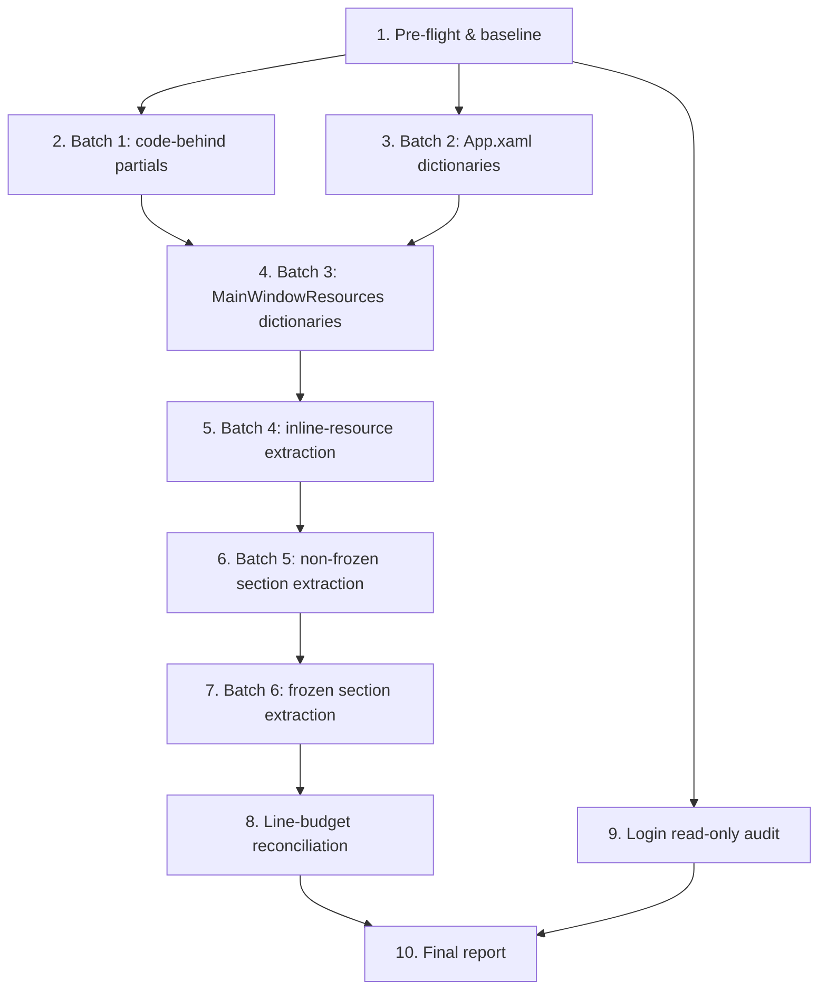

# Implementation Plan — Remaining UI Structural Governance

## Overview

Mechanical, behavior-preserving decomposition only. Each top-level task is a coherent commit batch
that must pass its validation gate before commit. No ViewModel/Service/Data/Core/gateway/cloudfunction/
QA-script/documentation changes. Login is audit-only this run. Frozen-page subtree extraction follows
the per-subtree extraction gate from the design.

## Task Dependency Graph



Sequencing notes: Batch 1 (code-behind) and Batch 2 (App.xaml) are independent and could run in either
order, but both must precede Batch 3 so chart-method co-location is settled before view extraction.
Batches 4→5→6 are strictly ordered because each operates on the evolving `MainWindow.xaml`. The Login
audit (Task 9) is independent and read-only; it may run any time after pre-flight but its outcome feeds
the final report.

```json
{
  "waves": [
    { "wave": 1, "tasks": ["1"] },
    { "wave": 2, "tasks": ["2", "3", "9"] },
    { "wave": 3, "tasks": ["4"] },
    { "wave": 4, "tasks": ["5"] },
    { "wave": 5, "tasks": ["6"] },
    { "wave": 6, "tasks": ["7"] },
    { "wave": 7, "tasks": ["8"] },
    { "wave": 8, "tasks": ["10"] }
  ]
}
```

## Tasks

- [ ] 1. Pre-flight verification, baseline capture & chart-destination scan
  - Confirm working tree clean, HEAD `1bb51a1`, branch `main` via `git status --short` / `git log -1`.
  - Record physical line counts of all 6 target files via `(Get-Content <path>).Count`.
  - Run the standard validation gate once on the unmodified tree to establish a green baseline.
  - Attempt baseline visual capture of reachable surfaces (main shell, workbench, charts) at 100% and 125%; record any state/scale that cannot be reliably reached.
  - **Chart-destination scan (move-once rule):** scan the Workbench (420–1271) and Cashflow (2059–2593) subtrees and the window-level `ViewModel_PropertyChanged` dispatch to decide the single final home of each chart handler group (`Trend*`, `Cashflow*`, `Donut*`):
    - If a subtree is safely extractable under the gate without changing event routing/dispatch, mark its chart handlers for **direct move into the extracted control** in Batch 5 (skip the temporary partial).
    - Otherwise mark them for the `MainWindow.*Charts.cs` partial split in Batch 1.
  - Record the decision; Batch 1 (2.1) and Batch 5 (6.2) follow it so chart code moves exactly once.
  - _Requirements: 9.1, 6.1, 6.2, 7.1, 7.2, 10.1, 3.6, 5.3_

- [ ] 2. Batch 1 — MainWindow.xaml.cs code-behind partial decomposition
- [ ] 2.1 Extract chart code-behind partials (verbatim) — ONLY for groups marked "partial" by the Task 1 scan
  - For each chart group the Task 1 scan marked as NOT safely extractable, create the corresponding partial verbatim:
    - `Views/MainWindow.TrendCharts.cs`: `TrendCanvas_SizeChanged`, `TrendTooltip_SizeChanged`, `UpdateTrendChart`, `UpdateTrendTooltipPosition`.
    - `Views/MainWindow.CashflowChart.cs`: `CashflowTrendCanvas_SizeChanged`, `UpdateCashflowTrendChart`.
    - `Views/MainWindow.DonutCharts.cs`: `CanvasIncomeDonut_SizeChanged`, `CanvasExpenseDonut_SizeChanged`, `UpdateDonutCharts`, `UpdateSingleDonutChart`, `DrawPlaceholderDonut`.
  - For any chart group marked "direct-to-control", DO NOT create a partial here — its handlers move straight into the extracted UserControl in Batch 5 (6.2).
  - Each new file: `namespace Orderly.App.Views; public partial class MainWindow : Window` + exact `using` directives required by the moved bodies.
  - _Requirements: 1.1, 2.3, 5.1, 5.3, 3.6_
- [ ] 2.2 Extract interaction/layout code-behind partials (verbatim)
  - Create `Views/MainWindow.WorkbenchInteractions.cs` (date-range popup handlers).
  - Create `Views/MainWindow.FulfillmentInteractions.cs` (fulfillment click/double-click/stepper/keydown/close-detail handlers).
  - Create `Views/MainWindow.ExceptionInteractions.cs` (exception double-click/close-detail/jump handlers).
  - Create `Views/MainWindow.SettingsInteractions.cs` (`SettingsTextInput_LostFocus`).
  - Create `Views/MainWindow.ResponsiveLayout.cs` (`MainWindow_SizeChanged`, `UpdateCashflowTrendCardVisibility`).
  - Move method bodies byte-for-byte; do not alter logic, constants, animation values, command calls, or event routing.
  - _Requirements: 1.1, 3.2, 3.3, 4.1, 4.2, 5.1_
- [ ] 2.3 Reduce residual MainWindow.xaml.cs to core
  - Leave only field `_copyToastCts`, ctor, `OnClosing`, `ViewModel_PropertyChanged`, `FindAncestor<T>`, `ShowCopyToast`, `CopyText_Click` in `MainWindow.xaml.cs`.
  - Verify `MainWindow.xaml.cs` and every new `MainWindow.*.cs` are ≤ 300 physical lines.
  - _Requirements: 1.1, 5.1_
- [ ] 2.4 Validate & commit Batch 1
  - Run the standard validation gate; confirm only intended `MainWindow*.cs` files changed via diff review.
  - Charts are non-visible-state-dependent code paths; record visual-state reachability per R7. Commit `refactor(ui): split main window code-behind into partials` only if green.
  - _Requirements: 6.1, 6.2, 6.4, 7.3, 9.2, 9.3, 9.5_

- [ ] 3. Batch 2 — App.xaml merged-dictionary decomposition
- [ ] 3.1 Create app-level resource dictionaries (verbatim)
  - Create `Views/Resources/App/AppBaseResources.xaml` (brand image, 8 brushes, implicit `Window`/`ScrollBar`/`Button` styles).
  - Create `Views/Resources/App/AppInputStyles.xaml` (implicit `TextBox`, `PasswordBox`, `ComboBox` styles).
  - Create `Views/Resources/App/AppButtonStyles.xaml` (`NavButtonStyle`, `CardBorderStyle`, dialog styles, chip styles).
  - Move each resource verbatim; preserve keys, values, and declaration order (base first so `BasedOn`/`StaticResource` resolve).
  - _Requirements: 1.2, 2.1, 2.5, 5.2_
- [ ] 3.2 Convert App.xaml to a merged-dictionary shell
  - Replace inline resources with `<Application.Resources><ResourceDictionary><ResourceDictionary.MergedDictionaries>` referencing the 3 new files in order, preserving startup/application resource behavior.
  - Verify `App.xaml` and each new file are ≤ 300 physical lines.
  - _Requirements: 1.2, 2.5, 5.2_
- [ ] 3.3 Validate & commit Batch 2
  - Run the standard validation gate; diff review confirms only `App.xaml` + new app dictionaries changed.
  - Capture visual evidence of app-wide styled controls (buttons/inputs) at 100%/125% where reachable; record limitations.
  - Commit `refactor(ui): split app resources into merged dictionaries` only if green.
  - _Requirements: 6.1, 6.2, 6.4, 7.1, 7.4, 9.2, 9.3, 9.5_

- [ ] 4. Batch 3 — MainWindowResources.xaml merged-dictionary decomposition
- [ ] 4.1 Create shared + component + template dictionaries (verbatim)
  - Create `Views/Resources/Main/MainSharedResources.xaml` (converters, brushes, `CardShadow`).
  - Create `Views/Resources/Main/MainComponentStyles.xaml` (text/card/list/toolbar/exception-button/paging/copy/pill/tab styles).
  - Create `Views/Resources/Main/MainListTemplates.xaml` (`CustomerListItemTemplate`, `OrderListItemTemplate`).
  - If `MainComponentStyles.xaml` exceeds 300, split mechanically by key into ≤300 sub-dictionaries; if any single style block alone > 300, leave intact and record as irreducible blocker.
  - _Requirements: 1.3, 1.5, 2.1, 2.5, 5.2_
- [ ] 4.2 Create settings + navigation dictionaries (verbatim, gated)
  - Create `Views/Resources/Main/MainSettingsResources*.xaml` — split the Settings styles (783–1458) by key into ≤300 files (e.g. `.Base`, `.Controls`, `.Rows`). Verbatim relocation only; no Settings behavior change.
  - Create `Views/Resources/Main/MainNavigationStyles*.xaml` — split nav/profile styles (1460–1854) by key into ≤300 files.
  - Record any single template/style block > 300 lines as an irreducible blocker rather than rewriting.
  - _Requirements: 1.3, 1.5, 2.1, 2.5, 4.1, 5.2_
- [ ] 4.3 Convert MainWindowResources.xaml to a merged-dictionary shell
  - Replace contents with a `ResourceDictionary` whose `MergedDictionaries` reference the new files in original declaration order (shared → components → templates → settings → navigation).
  - Confirm `MainWindow.xaml`'s single reference to `MainWindowResources.xaml` is unchanged and all keys resolve.
  - Verify the shell and every new file are ≤ 300 (except recorded irreducible blockers).
  - _Requirements: 1.3, 2.5, 3.1, 5.2_
- [ ] 4.4 Validate & commit Batch 3
  - Run the standard validation gate; diff review confirms only resource files changed.
  - Capture visual evidence of styled surfaces (lists, cards, settings rows) at 100%/125% where reachable; record limitations.
  - Commit `refactor(ui): split main window resource dictionaries` only if green.
  - _Requirements: 6.1, 6.2, 6.4, 7.1, 7.4, 9.2, 9.3, 9.5_

- [ ] 5. Batch 4 — MainWindow.xaml inline-resource extraction (R-4)
- [ ] 5.1 Extract inline Window.Resources styles
  - Create `Views/Resources/Main/MainWindowInlineStyles.xaml` containing the inline `FulfillmentInputTextBoxStyle`, `FulfillmentComboBoxToggleButtonStyle`, ComboBox item/main styles (lines 16–252) verbatim.
  - Update `MainWindow.xaml` `Window.Resources` to merge this dictionary alongside the existing `MainWindowResources.xaml` merge, preserving merge order and keys.
  - _Requirements: 1.4, 2.5, 3.1, 5.2_
- [ ] 5.2 Validate & commit Batch 4
  - Run the standard validation gate; diff review confirms only `MainWindow.xaml` + new inline dictionary changed.
  - Capture visual evidence of fulfillment inputs/combos at 100%/125% where reachable; record limitations.
  - Commit `refactor(ui): extract main window inline styles to dictionary` only if green.
  - _Requirements: 6.1, 6.2, 6.4, 7.1, 7.4, 9.2, 9.3, 9.5_

- [ ] 6. Batch 5 — MainWindow.xaml non-frozen section extraction
- [ ] 6.1 Self-containment pre-scan
  - For each non-frozen section (Workbench 420–1271, Inventory 1273–2057, Cashflow 2059–2593, Me 7979–8287, shell/nav), scan for `x:Name` referenced by code-behind outside the subtree and for `ElementName=` bindings crossing the boundary.
  - Note chart-related named elements (`TrendCanvas`, `TrendTooltip`, `TrendPath`, `TrendPoint*`, `CashflowTrendCanvas`, `CanvasIncomeDonut`, `CanvasExpenseDonut`, `CashflowTrendCard`, `CashflowFirstRow`, `CashflowTrendRow`, `CashflowBreakdownRow`, tooltip text blocks) — these are accessed by chart partials and must stay co-located with their handlers (move handlers to the extracted control, or keep section in place if coupling spans shell).
  - Record per-section verdict: extractable / smaller-seam / defer-with-blocker.
  - _Requirements: 3.1, 3.2, 3.4, 3.6, 5.3_
- [ ] 6.2 Extract self-contained non-frozen sections to UserControls
  - For each extractable section, create `Views/Sections/<Name>View.xaml` (+ `.xaml.cs`) as a `UserControl` with the subtree moved verbatim; no explicit DataContext (inherit from parent).
  - Move associated event handlers verbatim into the UserControl code-behind; relocate any chart-update partial methods that the section's named elements require, keeping behavior identical.
  - Replace the section in `MainWindow.xaml` with `<sections:<Name>View />` wrapped to preserve the `SectionVisibilityConverter` visibility binding and `Grid.Row`.
  - Verify each new XAML and code-behind file is ≤ 300 (sub-split large subtrees into nested child controls where a self-contained inner seam exists; otherwise record blocker).
  - _Requirements: 1.4, 2.1, 2.2, 2.3, 2.4, 3.1, 3.2, 3.3, 3.4, 3.5, 5.2, 5.3_
- [ ] 6.3 Validate & commit Batch 5
  - Run the standard validation gate; diff review confirms only `MainWindow.xaml` + new section files changed.
  - Capture before/after visual evidence for each extracted non-frozen surface at 100%/125% where reachable; record limitations. Verify navigation between sections still toggles visibility correctly.
  - Commit `refactor(ui): extract non-frozen main window sections into usercontrols` only if green.
  - _Requirements: 6.1, 6.2, 6.4, 7.1, 7.2, 7.4, 9.2, 9.3, 9.5_

- [ ] 7. Batch 6 — MainWindow.xaml frozen section extraction (gated per subtree)
- [ ] 7.1 Per-subtree extraction gate for frozen sections
  - For Fulfillment (2595–5249), Exception (5251–6397), Settings (6399–7977): run all three gate checks (self-contained; verbatim-only XAML+handler relocation with no VM/Service/Data/gateway/QA/doc edit; no command/binding/event/animation/visual change).
  - Confirm no protected business boundary (payment callback verification, auto-transition-to-paid, WeChat shipping sync, payment-success-to-fulfillment loop, settings save/validation/runtime-hook, exception-order, cloud-sync, schema/API/gateway) is touched.
  - Record per-subtree verdict; any failing subtree is left in place and reported as a blocker.
  - _Requirements: 3.6, 4.1, 4.2, 4.4, 5.3_
- [ ] 7.2 Extract gate-passing frozen subtrees to UserControls
  - For each passing frozen subtree, create `Views/Sections/<Name>View.xaml` (+ `.xaml.cs`) with the subtree + its handlers moved verbatim; inherit DataContext from parent.
  - Replace the section in `MainWindow.xaml` with the control reference, preserving visibility binding and layout.
  - Sub-split where a self-contained inner seam exists to reach ≤ 300; otherwise record the residual as an irreducible blocker.
  - _Requirements: 1.4, 2.1, 2.2, 2.3, 2.4, 3.1, 3.2, 3.3, 3.4, 3.5, 4.1, 4.2, 5.2, 5.3_
- [ ] 7.3 Validate & commit Batch 6
  - Run the standard validation gate; diff review confirms only `MainWindow.xaml` + new frozen-section files changed.
  - Capture before/after visual evidence for each extracted frozen surface at 100%/125% where reachable; record limitations. Exercise navigation to each frozen page to confirm visibility/interaction unchanged.
  - Commit `refactor(ui): extract frozen main window sections into usercontrols` only if green.
  - _Requirements: 4.1, 4.2, 6.1, 6.2, 6.4, 7.1, 7.2, 7.4, 9.2, 9.3, 9.5_

- [ ] 8. Final MainWindow.xaml line-budget reconciliation
  - Recount `MainWindow.xaml` and all new section files; for any file still > 300, record the exact irreducible block + line count as a blocker (Requirement 1.5).
  - Confirm no new ViewModel was introduced and DataContext semantics are preserved across all extractions.
  - _Requirements: 1.4, 1.5, 3.5, 10.1_

- [ ] 9. Login family read-only audit (no edit)
  - Read `LoginView.xaml` and `LoginView.xaml.cs`; produce a decomposition plan, available validation-coverage assessment (incl. `run-p4-local-account-encryption-restore-smoke.ps1`, `run-p4-local-account-backup-smoke.ps1`, PIN/lock coverage), and risk assessment.
  - Do NOT modify any Login file. Present the plan and WAIT for explicit user approval.
  - _Requirements: 8.1, 8.2, 8.3, 8.4_

- [ ] 10. Final implementation report
  - Report starting state; decomposition sequence used; each commit (hash, message, file list, affected surface, validation, visual verification); final UI line-budget inventory (path, final count, PASS / REMAINS OVER BUDGET + blocker); automated + manual 100%/125% results (or recorded limitations); protected-boundary confirmation; remaining work + the Login decision awaiting approval.
  - _Requirements: 10.1, 8.3_

## Notes

### Standard validation gate (run before every commit)

```
dotnet build Orderly.sln -c Debug
powershell -ExecutionPolicy Bypass -File .\tools\qa\run-qa-data-status.ps1
powershell -ExecutionPolicy Bypass -File .\tools\qa\run-p1-smoke.ps1
powershell -ExecutionPolicy Bypass -File .\tools\qa\run-p3-1-workbench-smoke.ps1
powershell -ExecutionPolicy Bypass -File .\tools\qa\run-p3-2-pipeline-smoke.ps1
powershell -ExecutionPolicy Bypass -File .\tools\qa\run-p3-4-workbench-logic-smoke.ps1
powershell -ExecutionPolicy Bypass -File .\tools\qa\run-p3-5-search-smoke.ps1
powershell -ExecutionPolicy Bypass -File .\tools\qa\run-p3-6-navigation-smoke.ps1
git status --short
```

If a listed script is absent or not safely runnable in the environment, state this clearly and run all
remaining safe gates (Requirement 6.3).

### Login-specific gate (only if Login approval is later granted — not this run)

```
powershell -ExecutionPolicy Bypass -File .\tools\qa\run-p4-local-account-encryption-restore-smoke.ps1
powershell -ExecutionPolicy Bypass -File .\tools\qa\run-p4-local-account-backup-smoke.ps1
```

### Hard rules carried from requirements & AGENTS.md

- Every moved member/resource/subtree is relocated verbatim; no logic, value, binding, command, event, or animation change.
- New files belong to `Orderly.App` only; wiring via partial classes, merged dictionaries, or control references.
- Do not push to any remote. Commit only intended UI files per batch after diff review.
- Any file that cannot reach ≤300 without rewriting a single indivisible block: leave intact and report as an irreducible blocker.
- Protected business boundaries (payment callback verification, auto-transition-to-paid, WeChat shipping sync, payment-success-to-fulfillment loop, settings save/validation/runtime-hook, exception-order, cloud-sync, schema/data/API/gateway) must remain unchanged.
