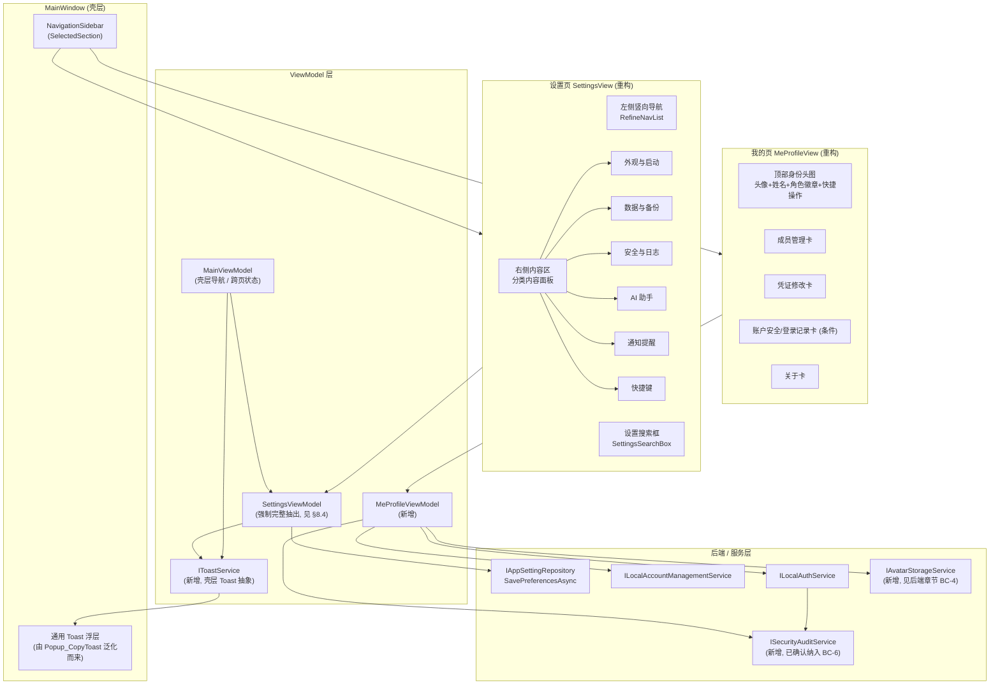
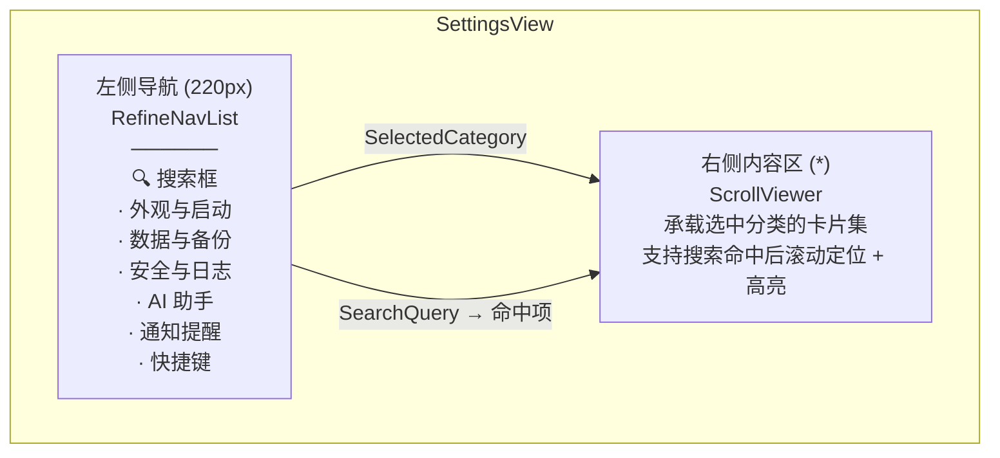
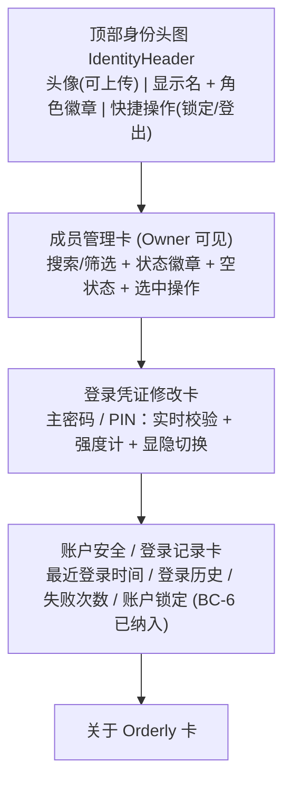
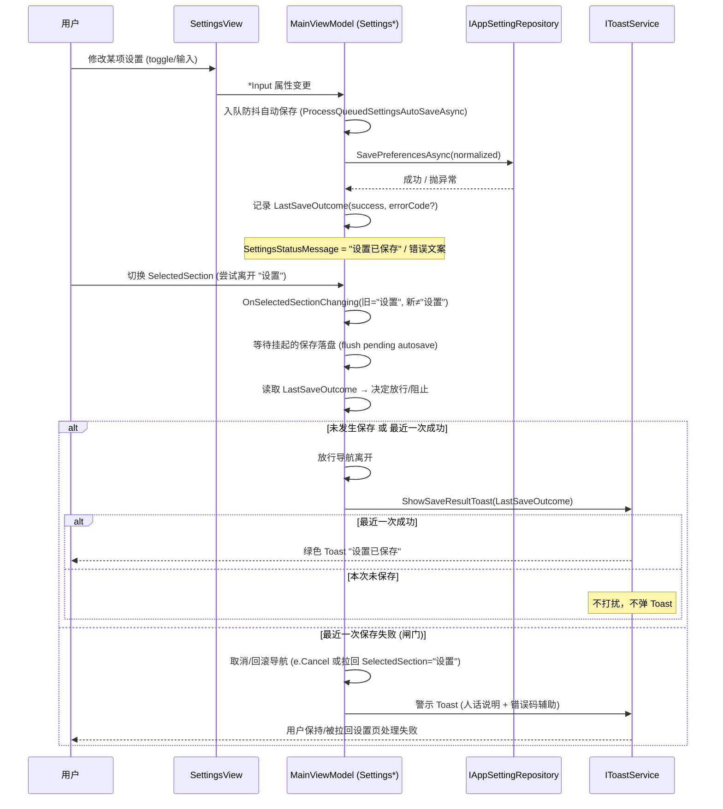
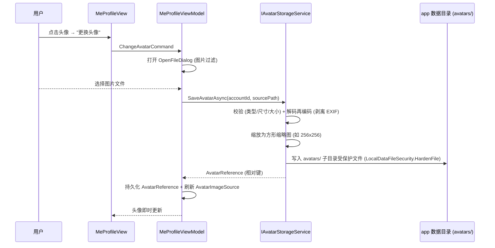

# 设计文档：设置页与我的页精装升级 (settings-profile-refinement)

> 说明：本文为 **设计/规划文档**，不包含任何代码改动。文中 UI 文案使用简体中文，代码标识符 / 类型名 / 属性名保持英文。所有需要触碰后端（新增字段、迁移、仓储方法、审计读取等）的内容统一收敛到末尾的 **「后端改动 / Backend Changes (已确认)」** 章节。原 §12 开放问题 OQ-1..OQ-6 已由用户确认（见 §12.1「已确认决策」），相关结论已在各章节落定。
>
> 范围严格限定在 **设置页（设置 / Settings）** 与 **我的页（我的 / Me-Profile）** 两个板块。不触碰登录页、订单履约、异常处理、工作台、订单、商品、库存、客户、现金流、经营建议等其它页面的 UI。

---

## Overview

**1. 概述**

当前设置页采用顶部 `TabControl`（5 个 Tab：应用与外观 / 数据与安全 / AI 助手 / 系统提醒 / 快捷键），我的页采用「左卡片 + 右滚动列」两栏布局并直接复用 `MainViewModel`，密码框依赖 code-behind 双向同步。两个页面已具备完整功能骨架，但视觉语言、信息架构、代码结构、交互反馈仍处于「能用」而非「精致」的阶段。

本设计将两个页面统一升级为一套现代高级感（macOS / Notion 取向：柔和阴影 + 大圆角 + 充裕留白）的设计系统，并完成三类升级：

1. **视觉与信息架构升级**：抽取一套可复用的设计令牌（Design Tokens），设置页从顶部 Tab 改为左侧竖向导航 + 右侧内容区，并新增设置项搜索；我的页从两栏布局改为「顶部身份头图 + 下方功能卡片堆叠」。
2. **交互与功能增强**：自动保存基础上叠加「离开设置页时的保存结果 Toast」；我的页新增本地头像上传、密码/PIN 表单实时校验与强度计、密码显隐切换、成员管理搜索/状态徽章/空状态、以及（条件性的）账户安全/登录记录展示。
3. **代码结构重构**：抽出独立的 `MeProfileViewModel`；用 MVVM 友好的 `PasswordBox` 附加行为替换 code-behind 同步逻辑；统一 section 可见性绑定；修复过期 QA 锚点与错号注释；**完整抽出独立 `SettingsViewModel`**（迁移全部 `Settings*` 分部状态与逻辑，见 §8.4）。

设计遵循「自动保存语义不变、加密本地存储不破坏、绝不延长明文凭证生命周期」三条安全底线。

---

## 2. 设计目标与原则 (Design Goals & Principles)

| 编号 | 原则 | 说明 |
| --- | --- | --- |
| P1 | 单一设计语言 | 设置页与我的页共用同一套 Design Tokens 与控件样式，视觉上不可区分为「两个团队」。 |
| P2 | 复用优先，扩展次之 | 优先复用 / 扩展现有 `MainWindowResources.xaml`、`MainWindowInlineStyles.xaml` 与既有样式（`SettingsGroupCardStyle` 等），仅在缺口处新增令牌，避免推倒重来。 |
| P3 | 保持自动保存语义 | 即改即存（autosave）行为不变，新增反馈仅作叠加，不得引入「需手动点保存」的回退。 |
| P4 | 安全不回退 | 凭证仍走现有加密通道；明文密码在内存中存在时间不超过命令执行所需；新增头像/审计读取不得绕过 SQLCipher 加密存储。 |
| P5 | MVVM 纯净度 | 减少 code-behind；密码框通过附加行为桥接 ViewModel；可见性、搜索、校验等逻辑下沉到 ViewModel。 |
| P6 | 后端改动显式化 | 任何后端触碰先在文档中标注 `[需确认]`，确认后才实施，遵循最小作用域。 |
| P7 | 可测试与可回归 | 为重设计后的设置页提供稳定的 AutomationId 内容锚点，修复 QA smoke 脚本对已不存在的 `Btn_SavePreferences` 的依赖。 |

---

## 3. 设计令牌与视觉系统 (Design Tokens / Visual System)

设计令牌以资源字典形式集中维护，建议新增一个**专用令牌字典** `Views/Resources/DesignTokens.xaml`（仅供设置页与我的页消费，避免污染其它页面），并在两个页面的 `UserControl.Resources` 中按需 Merge。令牌不直接改写其它页面正在使用的画刷键，新增键采用 `Refine*` / `Token*` 前缀以避免命名冲突。

### 3.1 圆角刻度 (Corner Radius Scale)

| 令牌键 | 值 | 用途 |
| --- | --- | --- |
| `RadiusSm` | `8` | 输入框、内嵌小卡、徽章 |
| `RadiusMd` | `12` | 行项目、次级卡片 |
| `RadiusLg` | `16` | 主功能卡片（替代当前 ~10） |
| `RadiusXl` | `20` | 顶部身份头图容器 |
| `RadiusPill` | `999` | 胶囊按钮 / 状态徽章 |

### 3.2 阴影 / 高度刻度 (Shadow / Elevation Scale)

以 `DropShadowEffect` 表达，统一方向 `270°`、低不透明度，营造柔和悬浮感。

| 令牌键 | BlurRadius | ShadowDepth | Opacity | 用途 |
| --- | --- | --- | --- | --- |
| `ElevationCard` | 18 | 2 | 0.06 | 静态卡片 |
| `ElevationRaised` | 28 | 4 | 0.10 | hover / 选中态卡片 |
| `ElevationToast` | 12 | 2 | 0.18 | Toast 浮层（沿用现有 toast 风格基调） |

### 3.3 间距刻度 (Spacing Scale, 8pt grid)

`SpaceXxs=4`、`SpaceXs=8`、`SpaceSm=12`、`SpaceMd=16`、`SpaceLg=24`、`SpaceXl=32`、`SpaceXxl=48`。卡片内边距统一为 `SpaceLg(24)`，卡片间距 `SpaceMd(16)`，区块大留白用 `SpaceXl/Xxl`。

### 3.4 字阶 (Typography Hierarchy)

| 令牌键 | FontSize | FontWeight | 对应现有样式 | 用途 |
| --- | --- | --- | --- | --- |
| `TypeDisplay` | 28–29 | Bold | 现共享页头 | 页面级标题（我的页头图主名） |
| `TypeTitle` | 18 | Bold | — | 卡片标题 / 身份名 |
| `TypeGroupTitle` | 15–16 | SemiBold | `SettingsGroupTitleStyle` | 卡片分组标题 |
| `TypeItemTitle` | 13–14 | Medium | `SettingsItemTitleStyle` | 行项标题 |
| `TypeBody` | 13 | Normal | — | 正文 |
| `TypeCaption` | 11–12 | Normal | `SettingsItemDescStyle` | 描述 / 辅助说明 |

### 3.5 既有样式映射与扩展

复用并「精装化」以下既有样式（仅微调圆角/阴影/留白令牌引用，不改变其结构与绑定）：`SettingsGroupCardStyle`、`SettingsGroupTitleStyle`、`SettingsItemTitleStyle`、`SettingsItemDescStyle`、`SettingsRowItemBorder`、`SettingsSegmentedControlStyle`、`SettingsSegmentedItemStyle`、`SettingsRowCheckBoxStyle`、`SettingsRowTextBoxStyle`、`SettingsScrollViewerStyle`、`ToolbarPrimaryButtonStyle`、`ToolbarSecondaryButtonStyle`。

新增样式（设置/我的页专用）：`RefineNavListStyle`（左侧导航列表）、`RefineNavItemStyle`（导航项）、`RefineSearchBoxStyle`（搜索框）、`RefineIdentityHeaderStyle`（身份头图）、`RefineToastStyle`（通用 Toast）、`RefineStatusBadgeStyle`（启用/禁用徽章）、`RefinePasswordRevealButtonStyle`（密码显隐按钮）、`RefineStrengthMeterStyle`（强度计）。

> 既有画刷 `HeadingBrush / SecondaryTextBrush / BorderBrushSoft / PrimaryBrush / AccentSoftBrush / DangerTextBrush / MutedBrush / PageBackgroundBrush / SurfaceRaisedBrush` 全部保留沿用。

---

## Architecture

**4. 高层架构 (High-Level Architecture)**

### 4.1 组件总览



> 说明（已确认）：
> - `SettingsViewModel` 为**强制完整抽出**（非可选门面）。设置页 `SettingsView` 直接绑定 `SettingsViewModel`，`MainViewModel` 仅保留壳层导航与跨页协调（见 §8.4）。
> - 安全审计能力（`ISecurityAuditService`，BC-6）**已确认纳入本期**：认证路径写入安全事件，我的页「账户安全 / 登录记录」卡片经读取 API 展示登录历史 / 失败次数 / 账户锁定记录（见 §6.4、§10.2）。

### 4.2 设置页新信息架构（左导航 + 内容区）



设置页内部用「左 `ListBox`（导航）+ 右 `ContentControl`/分区 `ScrollViewer`」结构替换 `TabControl`。左导航选中项驱动右侧显示对应分类内容；搜索命中项驱动右侧滚动定位并临时高亮目标行。详见 §7 信息架构映射、§9 低层设计中的搜索算法。

### 4.3 我的页新布局（顶部头图 + 卡片堆叠）



我的页从「左卡 + 右列」改为**单列纵向堆叠**：顶部一张通栏身份头图卡，下方依次堆叠功能卡片，整体置于带最大宽度约束的居中容器内（沿用现有 `MaxWidth` 居中模式），随窗口自适应。

### 4.4 自动保存 + 离开页 Toast 数据流



要点：
- 不改变即改即存：Toast 仅在**离开设置页**这一时机汇总展示最近一次保存结果。
- **离开页导航闸门（Req 3.8 / Property 10）**：离开设置页的导航是否放行，由最近一次保存结果决定——
  - 放行 ⟺（最近一次保存成功 ∨ 本次停留未发生保存）；
  - **最近一次保存失败 → 阻止该次离开**：取消导航或将 `SelectedSection` 拉回「设置」，使用户保持/被拉回设置页，看到失败提示并处理，待保存恢复成功后方可离开。
- `LastSaveOutcome` 由 `SaveP0SettingsAsync` 的成功/异常路径写入（成功 / 失败 + 错误码）。
- 失败 Toast 文案采用「**人话说明为主 + 错误码辅助**」（Req 3.4 / Property 11，见 §9.5）：以面向普通用户的中文通俗说明为主体，稳定错误码作为括注辅助信息附带，不泄露内部异常类型名或堆栈细节。

### 4.5 头像上传流程



---

## Components and Interfaces

**5. 组件与接口**

### 5.1 设置页组件

| 组件 | 职责 | 备注 |
| --- | --- | --- |
| `SettingsView`（重构） | 容器：左导航 + 搜索 + 右内容区 | 移除 `TabControl`，改 `Grid`（左列固定宽 + 右列 *） |
| 既有 `SettingsTab*` 子控件 | 各分类内容面板 | **结构与绑定基本保留**，由右内容区按分类宿主，复用度最大化 |
| `SettingsSearchBox` | 设置项搜索输入 | 绑定 `SettingsSearchQuery`，命中后跳转/高亮 |
| 设置项索引 `SettingsSearchIndex` | 可搜索条目的静态索引（标题/描述/关键字/分类/锚点） | 见 §9.4 |

### 5.2 我的页组件

| 组件 | 职责 |
| --- | --- |
| `MeProfileView`（重构） | 单列：身份头图 + 功能卡片堆叠 |
| `IdentityHeader` | 头像（可上传）、显示名、角色徽章、锁定/登出快捷操作 |
| 成员管理卡 | 搜索/筛选成员、状态徽章、空状态、创建/重置/停用/**删除**操作；按角色与是否自身实施权限边界（见 §8.1 权限矩阵） |
| 凭证修改卡 | 主密码 / PIN 修改，含实时校验、强度计、显隐切换 |
| 账户安全/登录记录卡 | 展示最近登录时间 + 登录历史 / 失败次数 / 账户锁定 / 成员删除等记录，支持**按日期范围筛选**，由安全审计读取 API 驱动（BC-6 已纳入，见 §6.4、§10） |
| 关于卡 | 品牌与产品定位（保留） |

### 5.3 壳层 Toast 抽象（泛化既有 `Popup_CopyToast`）

现状：`MainWindow.xaml` 中存在 `Popup_CopyToast` + `Text_CopyToast`，由复制操作直接驱动。本设计将其**泛化**为通用 Toast，新增轻量服务接口供 ViewModel 调用，而不在 ViewModel 里直接操作 UI 控件。

```csharp
public enum ToastSeverity { Info, Success, Warning, Error }

public interface IToastService
{
    // 显示一条自动消失的轻量提示；duration 为空则用默认时长
    void Show(string message, ToastSeverity severity = ToastSeverity.Info, TimeSpan? duration = null);
}
```

`MainWindow` 实现/持有该服务（壳层），复制提示与设置保存结果提示统一走它。这样既复用了既有 toast 视觉，又满足 P5（ViewModel 不碰控件）。

---

## Data Models

**6. 数据模型**

### 6.1 现有偏好模型 `AppPreferences`（节选，保持不变的部分省略）

现有字段已覆盖外观、启动、备份、安全脱敏、AI、通知、快捷键等。本设计**新增**字段（详见 §10 后端章节，已确认纳入）：

```csharp
// AppPreferences 新增（已确认，BC-1）
public string? AvatarReference { get; set; }   // 头像文件相对引用/键；null 表示使用默认头像
```

### 6.2 头像存储模型

```csharp
// 头像引用：存储为相对键，真实文件落在 app 数据目录的受保护子目录
// 例： "avatars/{accountId}.png"，由 IAvatarStorageService 解析为绝对路径
public sealed record AvatarReference(string RelativeKey);
```

**头像校验常量（已确认，Req 6.1 / 6.6 / Property 16）**：

```csharp
public static class AvatarConstraints
{
    // 仅接受的图片格式（按解码后真实编码判定，不仅看扩展名）
    public static readonly string[] AcceptedFormats = { "JPG", "PNG", "WebP" };
    // 单张文件大小硬上限
    public const long MaxFileSizeBytes = 5L * 1024 * 1024;   // 5MB
    // 缩略图边长
    public const int ThumbnailEdge = 256;
}
```

校验通过判定（与 Property 16 一致）：`Accepted ⟺ (格式 ∈ {JPG, PNG, WebP}) ∧ (文件大小 ≤ 5MB) ∧ (可成功解码)`。

**拒绝路径（Req 6.6）**：任一条件不满足时，`IAvatarStorageService.SaveAvatarAsync` 抛验证异常 → `MeProfileViewModel` 捕获后**保留原头像**（不更新 `AvatarReference`）并就地提示「图片无效或过大」，不弹离开页 Toast。

**默认占位头像（Req 6.5）**：当 `AvatarReference == null`（无头像引用）时，`MeProfileView` 渲染默认占位头像，其形式为「**渐变底色 + 用户名首字**」——首字取用户显示名的首个字符：中文取首个汉字，拉丁文取首字母（统一大写）；显示名为空时回退为通用占位字符。该占位在前端纯展示层生成，不写入存储、不入加密库。

存储位置（已确认采用方案 A，OQ-1 决策）：
- **方案 A（已采纳）**：落在 app 数据根目录下 `avatars/` 子目录，文件名以 `accountId` 派生，写入时复用 `LocalDataFileSecurity` 既有 `HardenFile` 模式对目录/文件加固；写入前对图片解码再编码以剥离 EXIF，并缩放为方形缩略图。引用键存入 `AppPreferences.AvatarReference`。头像为非机密的展示资源，文件系统隔离 + 目录加固即可，**不进 SQLCipher 库**。
- **方案 B（未采纳）**：头像二进制 BLOB 存入加密库新表/字段。安全性更高但需 schema 迁移、增大库体积，属过度设计，本期不采用。

### 6.3 成员列表模型 `LocalAccountSummary`（现有，已足够）

```csharp
public sealed class LocalAccountSummary
{
    public string AccountId { get; init; }
    public string Username { get; init; }
    public string DisplayName { get; init; }
    public LocalAccountRole Role { get; init; }
    public bool IsEnabled { get; init; }          // → 启用/禁用状态徽章
    public DateTime CreatedAt { get; init; }
    public DateTime? LastLoginAt { get; init; }    // → 最近登录时间展示
    public bool IsMostRecentlyLoggedIn { get; init; }
}
```

> 结论：成员管理增强所需字段（`IsEnabled` 状态徽章、`LastLoginAt` 最近登录）**已存在**，无需后端改动。

### 6.4 登录/安全记录读取模型（已确认纳入，详见 §10.2）

```csharp
// 已确认（BC-6）：安全审计读取模型，feed 进 MeProfileViewModel.SecurityAuditEntries
public sealed record SecurityAuditEntry(
    DateTime OccurredAt,
    string Kind,          // 登录成功 / 登录失败 / 账户锁定 / 凭证修改 ...
    string AccountLabel,
    string Detail);
```

**现状核查与决策结论**：经核查，`ActivityLog.ActivityType` 枚举**不含**任何登录/认证/安全事件类型（仅客户/订单/AI/备份等业务类）；`LocalAccount` 仅持有单个 `LastLoginAt` 时间戳；测试 `SecuritySensitiveEventAuditBugConditionTests` 明确记录「认证失败没有专用的防篡改安全审计接缝」。该接缝即为本期 BC-6 要填补的缺口。

用户已确认（OQ-2）**将安全审计后端纳入本期**，因此：
- **最近登录时间**：当前账号 / 各成员的 `LastLoginAt` 单值，继续直接展示（无需 BC-6 即可用）。
- **登录历史列表 / 登录失败次数 / 账户锁定记录 / 凭证修改记录 / 成员删除记录**：由 **BC-6 新增的安全审计能力**提供——新增安全审计事件类型（登录成功 / 登录失败 / 账户锁定 / 凭证变更 / 成员创建·重置·停用·删除）、在认证 / 账户路径植入防篡改写入接缝、提供查询读取 API（`ISecurityAuditService` / 仓储），将结果映射为 `SecurityAuditEntry` 注入 `MeProfileViewModel.SecurityAuditEntries`。
- BC-6 落地后 `IsSecurityAuditAvailable=true`，我的页「账户安全 / 登录记录」卡片正常渲染审计列表。该能力必须保持 P0 安全：防篡改、加密存储、绝不泄露明文凭证。

**按日期范围筛选交互（已确认，Req 9.6 / 9.7 / Property 15）**：安全卡提供日期范围筛选控件（起止日期），筛选状态绑定到 `MeProfileViewModel`，经 `ISecurityAuditService.QueryAsync` 的时间范围参数下推查询，仅展示落在所选范围内的记录。

```csharp
// MeProfileViewModel 安全卡日期范围筛选状态
[ObservableProperty] private DateTime? auditRangeStart;     // 起始日期（含），null 表示不限下界
[ObservableProperty] private DateTime? auditRangeEnd;       // 结束日期（含），null 表示不限上界
public IAsyncRelayCommand ApplyAuditDateRangeCommand { get; }   // → QueryAsync(from, to) → 刷新 SecurityAuditEntries
```

> 全量保留（Req 9.6）：日期筛选仅作用于**读取展示**，`Security_Audit_Service` 完整保留全部历史记录、不做截断或自动清除；任意写入序列后历史总量不因筛选/查询而减少（Property 15）。空范围或读取失败遵循 §Error Handling 的空状态 / 读取失败口径，绝不臆造数据。

---

## 7. 信息架构映射 (Information Architecture Mapping)

### 7.1 旧 Tab → 新左导航分类

当前 `SettingsView.xaml` 的注释错号（Tab 1,2,4,5,6，缺 3）仅为历史遗留，重构后统一消除。原 5 个 Tab 重新归类为 6 个左导航分类（对「数据与安全」做适度拆分，使「备份」与「安全/日志」各自聚焦）：

| 新分类（导航名） | 图标 | 来源（旧） | 承载的现有子控件 |
| --- | --- | --- | --- |
| 外观与启动 | `&#xE713;` | Tab1 应用与外观 | `SettingsTabAppearance`（个性化外观 + 启动与显示） |
| 数据与备份 | `&#xE8B5;` | Tab2 数据与安全（拆分①） | `SettingsTabData`（本地备份策略）+ `SettingsTabDataAudit` 的「数据校验与导入恢复」 |
| 安全与日志 | `&#xE72E;` | Tab2 数据与安全（拆分②） | `SettingsTabDataSecurity` + `SettingsTabDataAudit` 的「系统日志记录」 |
| AI 助手 | `&#xE99A;` | Tab3(原 AI) | `SettingsTabAi` + `SettingsTabAiDiagnostics` |
| 通知提醒 | `&#xE715;` | Tab5 系统提醒 | `SettingsTabNotify` |
| 快捷键 | `&#xE765;` | Tab6 快捷键 | `SettingsTabHotkeys` |

> 已确认（OQ-3）：采用上述**六分类**（对原「数据与安全」做适度拆分，使「备份」与「安全/日志」各自聚焦）。子控件本身的内部结构与绑定不变，仅改变其宿主与归类，符合最小作用域。

### 7.2 命名调整建议

- 「应用与外观」→「外观与启动」（更准确覆盖启动项）。
- 「系统提醒」→「通知提醒」（与文案「桌面弹窗通知」一致）。
- 其余命名保持，降低用户认知迁移成本。

### 7.3 搜索可达性

每个可搜索设置项在索引中登记其 **所属分类 + 稳定锚点 AutomationId**，搜索命中后：切换到对应分类 → 滚动定位到锚点 → 临时高亮（短暂背景色脉冲）。

---

## 8. 低层设计 (Low-Level Design)

> 语言：C# / WPF（项目既有技术栈）。以下为类签名、方法签名与关键算法的设计草案，命名遵循现有约定（`*Input` 暂存属性、`[ObservableProperty]`、`[RelayCommand]`、`CommunityToolkit.Mvvm`）。

### 8.1 `MeProfileViewModel`（新增，从 MainViewModel 抽出我的页相关状态）

```csharp
public partial class MeProfileViewModel : ObservableObject
{
    private readonly ILocalAccountManagementService _accountService;
    private readonly ILocalAuthService _authService;
    private readonly IAvatarStorageService _avatarService;     // 新增, 见 §10
    private readonly ISessionContextService _sessionContext;
    private readonly IToastService _toast;

    public MeProfileViewModel(
        ILocalAccountManagementService accountService,
        ILocalAuthService authService,
        IAvatarStorageService avatarService,
        ISessionContextService sessionContext,
        IToastService toast);

    // ── 身份头图 ──
    [ObservableProperty] private string currentAccountDisplayName = string.Empty;
    [ObservableProperty] private bool isCurrentUserOwner;
    [ObservableProperty] private ImageSource? avatarImageSource;   // null → 默认渐变占位
    public string RoleBadgeText => IsCurrentUserOwner ? "系统管理员 Owner" : "系统店员 Member";

    // ── 成员管理 ──
    public ObservableCollection<LocalAccountSummary> ManagedAccounts { get; } = new();
    public ICollectionView ManagedAccountsView { get; }            // 支持搜索/筛选
    [ObservableProperty] private string memberSearchQuery = string.Empty;
    [ObservableProperty] private LocalAccountSummary? selectedManagedAccount;
    public bool CanManageAccounts { get; }
    public bool CanOperateMember { get; }
    public bool IsMemberListEmpty => ManagedAccountsView is { IsEmpty: true };  // 空状态

    // 权限授权判定（§8.1.1 权限矩阵，Req 7 / Property 12）。入参 target 为目标成员，
    // 纯函数式判定，仅依据「当前账号角色 / 是否自身」，不读取 UI 状态。
    public bool CanCreateMember { get; }                                   // 仅 Owner
    public bool CanDeleteMember(LocalAccountSummary target);               // 仅 Owner 且 target 非自身
    public bool CanDisableMember(LocalAccountSummary target);              // Owner 任意 / 或 target 为自身

    // 新建/重置成员的暂存输入（绑定走 PasswordBox 附加行为, §8.3）
    [ObservableProperty] private string newMemberUsername = string.Empty;
    [ObservableProperty] private string newMemberDisplayName = string.Empty;
    [ObservableProperty] private string newMemberPassword = string.Empty;
    [ObservableProperty] private string newMemberPin = string.Empty;

    // ── 凭证修改 + 校验状态（§8.5 / §9.3） ──
    [ObservableProperty] private string currentMasterPasswordInput = string.Empty;
    [ObservableProperty] private string newCurrentMasterPasswordInput = string.Empty;
    [ObservableProperty] private string confirmNewMasterPasswordInput = string.Empty;   // 新增：二次确认
    [ObservableProperty] private string currentPinInput = string.Empty;
    [ObservableProperty] private string newCurrentPinInput = string.Empty;
    [ObservableProperty] private string confirmNewPinInput = string.Empty;              // 新增：二次确认
    public PasswordValidationState MasterPasswordValidation { get; }                    // 实时校验结果
    public PinValidationState PinValidation { get; }
    public PasswordStrength NewMasterPasswordStrength { get; }                          // 强度计

    // ── 账户安全/登录记录（条件，§10） ──
    [ObservableProperty] private DateTime? currentAccountLastLoginAt;
    public ObservableCollection<SecurityAuditEntry> SecurityAuditEntries { get; } = new();
    public bool IsSecurityAuditAvailable { get; }   // 后端未启用时为 false → 显示占位文案

    // ── 命令 ──
    public IAsyncRelayCommand RefreshManagedAccountsCommand { get; }
    public IAsyncRelayCommand CreateMemberCommand { get; }
    public IAsyncRelayCommand ResetMemberPasswordCommand { get; }
    public IAsyncRelayCommand ResetMemberPinCommand { get; }
    public IAsyncRelayCommand DisableMemberCommand { get; }
    public IAsyncRelayCommand DeleteMemberCommand { get; }     // 新增：删除=移除账号（Req 7.4/7.10）
    public IAsyncRelayCommand ChangeCurrentMasterPasswordCommand { get; }
    public IAsyncRelayCommand ChangeCurrentPinCommand { get; }
    public IAsyncRelayCommand ChangeAvatarCommand { get; }     // 新增
    public IAsyncRelayCommand RemoveAvatarCommand { get; }     // 新增
    public IRelayCommand LockSessionCommand { get; }
    public IRelayCommand LogoutCommand { get; }

    partial void OnMemberSearchQueryChanged(string value) => ManagedAccountsView.Refresh();
}
```

迁移说明：现有 `MainViewModel.AccountManagement*`、`MeProfile` 相关状态迁入本 VM；`MainViewModel` 通过组合（暴露 `MeProfile` 属性）或由 DI 直接为 `MeProfileView.DataContext` 注入新 VM。锁定/登出等跨页能力可保留在壳层、由本 VM 转发命令。

#### 8.1.1 成员管理权限矩阵（Req 7 / Property 12）

「创建 / 重置 / 停用 / 删除」四类成员操作的授权严格由「当前账号角色 + 操作类型 + 目标是否自身」三元组决定。授权判定为纯函数（便于属性测试），UI 仅据其结果显隐入口或拒绝执行：

| 操作 | Owner 对他人 | Owner 对自身 | Member 对他人 | Member 对自身 | 授权判定属性 |
| --- | --- | --- | --- | --- | --- |
| 创建成员 | ✅ | —（创建无目标，仅看角色） | ❌ | ❌ | `CanCreateMember = IsCurrentUserOwner` |
| 重置密码/PIN | ✅ | ✅ | ❌ | ❌（沿用既有约束） | 仅 Owner |
| 停用成员 | ✅ | ✅（Owner 可停用自身，Req 7.9） | ❌ | ✅（Member 可停用自身，Req 7.8） | `CanDisableMember(t) = IsCurrentUserOwner OR (t 为自身)` |
| 删除成员 | ✅ | ❌（Owner 不可删自身，Req 7.9） | ❌（非 Owner 拒绝，Req 7.6） | ❌（任何人不可删自身，Req 7.8/7.9） | `CanDeleteMember(t) = IsCurrentUserOwner AND (t 非自身)` |

**关键边界（与需求逐条对齐）：**
- **创建 / 删除仅 Owner**（Req 7.5 / 7.6）：`Member` 不显示创建入口、删除操作恒被拒绝。
- **停用限 Owner 或目标为自身**（Req 7.7 / 7.8 / 7.9）：`Member` 仅能停用自身；`Owner` 可停用任何人含自身。
- **任何人不可删除自身**（Req 7.8 / 7.9）：包括 `Owner` 不可删自身（但可停用自身）。
- **删除 ≠ 停用（两种独立能力，Req 7.10）**：
  - **删除（`DeleteMemberCommand`）**：经账户服务**移除该成员账号**（账号不再存在）。属不可逆操作，UI 须二次确认。
  - **停用（`DisableMemberCommand`）**：仅将目标 `IsEnabled` 置为 `false`、**保留账号**与其历史，可后续重新启用；状态徽章随之切换为「禁用」。

> 命令的 `CanExecute` 直接复用上述授权属性：`DeleteMemberCommand.CanExecute(t) = CanDeleteMember(t) && !IsBusy`，`DisableMemberCommand.CanExecute(t) = CanDisableMember(t) && !IsBusy`，`CreateMemberCommand.CanExecute = CanCreateMember && !IsBusy`。被拒绝时给出中文提示且不调用后端。删除/停用成员事件经 `ISecurityAuditService` 记录（`MemberDeleted` / `MemberDisabled`，见 §10.2）。

### 8.2 视图可见性统一

现状：`MeProfileView` 在自身 XAML 内声明 `Visibility = {Binding SelectedSection, Converter=SectionVisibilityConverter, ConverterParameter=我的}`，与其它 section（在 `MainWindow.xaml` 统一控制可见性）不一致。

设计：把可见性绑定**上移到 `MainWindow.xaml`**，与 `SettingsView` 等兄弟视图一致：

```xml
<!-- MainWindow.xaml（统一后） -->
<Sections:MeProfileView Grid.Row="1"
    Visibility="{Binding SelectedSection, Converter={StaticResource SectionVisibilityConverter}, ConverterParameter=我的}" />
```

移除 `MeProfileView.xaml` 根 `Grid` 上的内联可见性绑定。

### 8.3 `PasswordBox` 的 MVVM 附加行为（替换 code-behind）

现状：`MeProfileView.xaml.cs` 用 `SecretInput_PasswordChanged` + `ViewModel_PropertyChanged` 手动双向同步 8 个 `PasswordBox`。设计用一个**附加属性行为**取代，View 不再需要这段 code-behind。

```csharp
// 附加行为：把 PasswordBox.Password 安全地桥接到 VM 的字符串属性，
// 并在 VM 值被清空（命令成功后重置）时清空控件。
public static class PasswordBoxBinder
{
    // 用法：local:PasswordBoxBinder.BoundPassword="{Binding NewMemberPassword, Mode=TwoWay}"
    public static readonly DependencyProperty BoundPasswordProperty = /* ... */;

    public static string GetBoundPassword(DependencyObject d);
    public static void SetBoundPassword(DependencyObject d, string value);

    // 内部：订阅 PasswordChanged 写回 VM；监听 BoundPassword 变化，
    // 仅当与控件当前值不同才回写控件，避免循环；设置防重入标记 _isUpdating。
    private static void OnBoundPasswordChanged(DependencyObject d, DependencyPropertyChangedEventArgs e);
    private static void OnPasswordChanged(object sender, RoutedEventArgs e);
}
```

安全约束（P4）：
- 不为 `Password` 做长期缓存；附加属性仅在变更时同步，命令执行完立即由 VM 置空触发控件清空（保留现有「成功后清空」语义）。
- 不引入将明文写入日志/诊断的任何路径。
- 可选增强：提供 `SecureString` 通道版本，但鉴于现有命令消费 `string`，本期保持 `string` 以最小改动，且不延长其生命周期。

### 8.4 完整抽出 `SettingsViewModel`（已确认，OQ-4 决策）

现状设置逻辑分散在 7 个 `MainViewModel.Settings*` 分部类中，且 `MainViewModel` 还承载工作台/订单/客户等大量状态。

**已确认（OQ-4）：本期完整抽出一个独立的 `SettingsViewModel`**，将全部 7 个 `Settings*` 分部类的状态与逻辑迁入该 VM（不再保留「薄门面」折中方案）。用户已明确接受由此带来的**更高回归风险**与**更大重构面**。

**待迁移的分部类（全部 7 个）：**

| 现分部文件 | 迁移内容 |
| --- | --- |
| `MainViewModel.SettingsP0.cs` | P0 偏好状态、自动保存引擎入口（`SaveP0SettingsAsync`）、`OnSelectedSectionChanged` 中与设置相关的保存协调 |
| `MainViewModel.SettingsP0.Mapping.cs` | `*Input` 属性 ↔ `AppPreferences` 的规范化映射 |
| `MainViewModel.SettingsP0.Commands.cs` | 设置相关命令（备份/校验/导入恢复等触发） |
| `MainViewModel.SettingsP0.Status.cs` | `SettingsStatusMessage` / 保存状态文案 |
| `MainViewModel.SettingsP1.cs` | P1 偏好状态与映射 |
| `MainViewModel.SettingsP1.Ai.cs` | AI 助手设置与诊断 |
| `MainViewModel.SettingsP1.HotkeysNotifications.cs` | 快捷键与通知提醒设置、`TryApplyRuntimeHotkeysBeforeSave` |

#### 8.4.1 `SettingsViewModel` 类轮廓

```csharp
public partial class SettingsViewModel : ObservableObject
{
    private readonly IAppSettingRepository _settingRepository;
    private readonly ISettingsSearchIndex _searchIndex;
    private readonly IToastService _toast;
    // 其它现有依赖（备份/校验/AI 诊断/热键服务等）随分部迁入

    public SettingsViewModel(
        IAppSettingRepository settingRepository,
        ISettingsSearchIndex searchIndex,
        IToastService toast /* , ...其它现有服务 */);

    // ── 关键职责 ──
    // 1) 持有全部设置 *Input 状态（按分类分组，见 8.4.2）
    // 2) 自动保存引擎：入队防抖 → ProcessQueued → SaveP0SettingsAsync（即改即存，语义不变）
    // 3) 离开页保存结果聚合：LastSaveOutcome + 经 IToastService 弹出（见 §9.5）
    // 4) 设置搜索：SettingsSearchQuery / 查询结果 / 命中跳转信号（见 §9.4）

    // ── 自动保存引擎（自 SettingsP0.cs 迁入） ──
    [ObservableProperty] private string settingsStatusMessage = string.Empty;
    public SettingsSaveOutcome? LastSaveOutcome { get; private set; }
    private Task ProcessQueuedSettingsAutoSaveAsync();   // 防抖入队消费
    private Task SaveP0SettingsAsync();                  // 规范化 → SavePreferencesAsync → 记录 LastSaveOutcome

    // ── 设置搜索（新增逻辑，集中于此 VM） ──
    [ObservableProperty] private string settingsSearchQuery = string.Empty;
    public ObservableCollection<SettingsSearchEntry> SearchResults { get; } = new();
    [ObservableProperty] private string selectedCategoryKey = "外观与启动";
    [ObservableProperty] private string? pendingScrollAnchorId;
    public IRelayCommand<SettingsSearchEntry> ActivateSearchResultCommand { get; }
    partial void OnSettingsSearchQueryChanged(string value);  // → _searchIndex.Query → SearchResults

    // ── 离开页 Toast（由壳层在离开「设置」时调用） ──
    public Task FlushPendingAutoSaveAsync();
    public void ShowSaveResultToastOnLeave();   // 消费 LastSaveOutcome 后置空（§9.5）
}
```

#### 8.4.2 `*Input` 属性分组

迁入后的 `*Input` 暂存属性按六大分类（§7.1）成组组织，便于 `SettingsTab*` 子控件分别绑定：

- **外观与启动**：主题 / 强调色 / 启动项 / 显示密度等 `*Input`
- **数据与备份**：备份策略 / 周期 / 路径 / 数据校验与导入恢复 `*Input`
- **安全与日志**：脱敏开关 / 日志级别 / 系统日志记录 `*Input`
- **AI 助手**：AI 开关 / 模型 / 诊断 `*Input`
- **通知提醒**：桌面弹窗 / 提醒时限 `*Input`
- **快捷键**：各 Hotkey 绑定 `*Input`

#### 8.4.3 与 `MainViewModel` 的协调与共享状态处理

完整抽离的核心风险是**跨分部共享状态**与**壳层导航耦合**。设计约定如下边界：

- **壳层归 `MainViewModel`**：`SelectedSection`（壳层导航选中项）与「section 变更检测」仍由 `MainViewModel` 拥有。`MainViewModel.OnSelectedSectionChanging/Changed` 检测到「离开『设置』」时，调用 `SettingsViewModel.FlushPendingAutoSaveAsync()` 与 `ShowSaveResultToastOnLeave()`（见 §9.5）。即：**导航事件源在壳层，设置保存/Toast 的执行在 `SettingsViewModel`**。
- **设置状态归 `SettingsViewModel`**：全部设置 `*Input`、自动保存队列、`SettingsStatusMessage`、搜索状态由 `SettingsViewModel` 独占，`MainViewModel` 不再直接持有这些字段。
- **共享只读上下文**：若个别设置逻辑此前读取 `MainViewModel` 的跨页只读状态（如会话/账户上下文），改为通过构造注入相应服务（`ISessionContextService` 等）获取，**不反向依赖 `MainViewModel`**，消除循环引用。
- **DataContext 接线**：
  - `MainViewModel` 暴露 `public SettingsViewModel Settings { get; }`（组合持有，DI 注入）。
  - `MainWindow.xaml` 中 `SettingsView` 的 `DataContext` 绑定到 `{Binding Settings}`；其子控件 `SettingsTab*` 继承该 `DataContext`，绑定路径由 `MainViewModel.Xxx` 调整为相对 `SettingsViewModel.Xxx`（移除多余的前缀层级）。
  - 可见性仍由 `MainWindow.xaml` 用 `SelectedSection` 控制（与 §8.2 统一可见性一致）。

#### 8.4.4 迁移方法与风险控制

- **分步迁移**：按分部文件逐个搬迁（先 P0 状态与映射，再命令/状态文案，最后 P1/AI/热键），每步保持可编译、可运行，避免一次性大爆炸式改动。
- **绑定回归**：迁移后需逐分类核对 `SettingsTab*` 的绑定路径与 `AutomationId` 锚点（§11.3）保持稳定。
- **风险声明**：本项显著**扩大重构面**并提升回归风险（用户已明确接受）。`MainViewModel` 与 `SettingsViewModel` 的职责切分需在实施时配合充分的单元/烟测回归（§11）。

### 8.5 校验状态值对象

```csharp
public sealed record PasswordValidationState(
    bool IsCurrentProvided,
    bool IsNewLengthValid,      // 新密码长度 >= 8（提交硬门槛之一）
    bool IsConfirmMatch,        // 两次输入一致
    bool IsStrengthWeak,        // 长度达标但强度低于 Fair → 仅警告，不阻断
    string? Message)            // UI 实时提示文案（中文）
{
    // 提交门槛（Req 8.2 / Property 2）：仅要求「当前非空 + 新密码长度>=8 + 两次一致」；
    // 新密码强度不作为提交的硬性门槛，强度偏弱只产出警告文案。
    public bool CanSubmit => IsCurrentProvided && IsNewLengthValid && IsConfirmMatch;
}

public sealed record PinValidationState(
    bool IsCurrentProvided,
    bool IsNewDigitsValid,      // 纯数字且位数正确(6位)
    bool IsConfirmMatch,
    string? Message)
{
    public bool CanSubmit => IsCurrentProvided && IsNewDigitsValid && IsConfirmMatch;
}

public enum PasswordStrength { Empty, Weak, Fair, Good, Strong }
```

> 说明（Req 8.10 / Property 2）：`IsStrengthWeak` 仅用于驱动「强度偏弱」的中文警告文案，**不**参与 `CanSubmit` 计算。即新密码长度 `>= 8` 但强度低于 `Fair` 时，用户仍可提交，仅在表单内看到偏弱提示。

---

## 9. 关键算法 (Low-Level Algorithms)

> 以下为算法与流程的设计草案，语言为 C# / 结构化伪代码。UI 文案中文，标识符英文。所有算法均为纯函数或 ViewModel 内逻辑，不直接操作控件（P5）。

### 9.1 概述

本期需要明确算法的四块新增逻辑：

1. **密码强度评估**（§9.2）——驱动强度计与提交门槛。
2. **凭证表单实时校验**（§9.3）——主密码 / PIN 的实时反馈与 `CanSubmit`。
3. **设置搜索索引与过滤**（§9.4）——搜索框命中、跳转分类、滚动定位、临时高亮。
4. **离开页保存结果聚合与错误码**（§9.5）——离开设置页时的 Toast 聚合与稳定错误码。

### 9.2 密码强度算法 (Password Strength)

纯函数，返回 `PasswordStrength`（§8.5）。规则面向「本地优先 + 商家自用」场景，避免过度严苛但鼓励强口令。

```csharp
public static class PasswordStrengthEvaluator
{
    // 评分维度：长度、字符类别多样性、是否过短/过弱；并叠加弱模式（重复/可预测）惩罚
    public static PasswordStrength Evaluate(string password)
    {
        if (string.IsNullOrEmpty(password)) return PasswordStrength.Empty;

        int length = password.Length;
        bool hasLower = password.Any(char.IsLower);
        bool hasUpper = password.Any(char.IsUpper);
        bool hasDigit = password.Any(char.IsDigit);
        bool hasSymbol = password.Any(c => !char.IsLetterOrDigit(c));
        int categories = (hasLower ? 1 : 0) + (hasUpper ? 1 : 0)
                       + (hasDigit ? 1 : 0) + (hasSymbol ? 1 : 0);

        // 硬下限：长度 < 8 一律 Weak
        if (length < 8) return PasswordStrength.Weak;

        int score = 0;
        if (length >= 8)  score++;
        if (length >= 12) score++;
        if (length >= 16) score++;
        if (categories >= 2) score++;
        if (categories >= 3) score++;
        if (categories >= 4) score++;

        // 弱模式 / 可预测性惩罚（在长度/类别评分之上叠加，不改变既有打分维度）：
        // 命中重复或可预测弱模式时下调档位，使「追加字符却引入弱模式」可能降低强度。
        score -= WeakPatternPenalty(password);
        if (score < 0) score = 0;

        return score switch
        {
            <= 2 => PasswordStrength.Weak,
            3    => PasswordStrength.Fair,
            4    => PasswordStrength.Good,
            _    => PasswordStrength.Strong
        };
    }

    // 检测重复 / 可预测弱模式，返回惩罚分（0 表示无惩罚）。
    // 仅作为附加惩罚层，不参与长度/类别的正向打分。
    private static int WeakPatternPenalty(string password)
    {
        int penalty = 0;

        // 1) 长重复串：同一字符连续出现 ≥ 4 次（如 "aaaa"、"1111"）。
        int run = 1, maxRun = 1;
        for (int i = 1; i < password.Length; i++)
        {
            run = password[i] == password[i - 1] ? run + 1 : 1;
            if (run > maxRun) maxRun = run;
        }
        if (maxRun >= 4) penalty += 2;
        else if (maxRun >= 3) penalty += 1;

        // 2) 简单顺序模式：连续递增/递减 ≥ 4 个字符（如 "1234"、"abcd"、"4321"）。
        int seqUp = 1, seqDown = 1, maxSeq = 1;
        for (int i = 1; i < password.Length; i++)
        {
            int delta = password[i] - password[i - 1];
            seqUp   = delta == 1  ? seqUp + 1   : 1;
            seqDown = delta == -1 ? seqDown + 1 : 1;
            maxSeq = Math.Max(maxSeq, Math.Max(seqUp, seqDown));
        }
        if (maxSeq >= 4) penalty += 2;

        return penalty;
    }
}
```

**规则要点：**
- **提交门槛（Req 8.2 / Property 2）**：主密码提交门槛 = 当前密码非空 ∧ 新密码 `length >= 8` ∧ 两次一致；**新密码强度不作为硬门槛**。强度档仅驱动强度计 UI 与「偏弱警告」文案。
- **强度偏弱警告（Req 8.10）**：当新密码 `length >= 8` 但 `Evaluate(...) < Fair` 时，表单显示「密码强度偏弱…（不影响提交）」中文警告，但 `CanSubmit` 不受影响，用户仍可提交。
- 强度计 UI：5 档映射为不同长度/颜色的进度条（`RefineStrengthMeterStyle`），颜色取自既有画刷（弱=`DangerTextBrush`，中=暖色，强=`PrimaryBrush`）。
- **弱模式 / 可预测性（REQ-8.9）**：在长度/类别正向评分之上叠加惩罚层 `WeakPatternPenalty`。当口令含长重复串（同字符连续 ≥ 3/4 次）或简单顺序模式（连续递增/递减 ≥ 4 个字符）时下调档位。因此**即使在已有密码后追加字符、长度增长且字符类别集合不减少，只要追加内容构成重复或可预测的弱模式，强度档仍可能下降**；不构成弱模式时仍维持「不低于原密码」的单调性（见 Property 1）。
- 评估在内存中即时进行，**不记录、不持久化、不出现在日志**（P4）。

### 9.3 凭证表单实时校验 (Real-time Validation)

主密码与 PIN 的校验在 `*Input` 属性变更时重算，产出 `PasswordValidationState` / `PinValidationState`（§8.5），供 UI 实时显示与命令 `CanExecute` 使用。

```
FUNCTION RecomputeMasterPasswordValidation():
    isCurrentProvided ← NOT IsNullOrEmpty(CurrentMasterPasswordInput)
    strength          ← PasswordStrengthEvaluator.Evaluate(NewCurrentMasterPasswordInput)
    isNewLengthValid  ← (len(NewCurrentMasterPasswordInput) >= 8)        // 唯一长度门槛
    isStrengthWeak    ← isNewLengthValid AND (strength < Fair)           // 仅触发警告，不阻断
    isConfirmMatch    ← (NewCurrentMasterPasswordInput == ConfirmNewMasterPasswordInput)
                        AND NOT IsNullOrEmpty(NewCurrentMasterPasswordInput)

    // 文案优先级：阻断项优先，其次「强度偏弱」警告（不阻断），最后通过态
    message ← FIRST applicable:
        NOT isCurrentProvided  → "请先输入当前密码"
        NOT isNewLengthValid   → "新密码至少 8 位"
        NOT isConfirmMatch     → "两次输入的新密码不一致"
        isStrengthWeak         → "密码强度偏弱，建议混合大小写/数字/符号（不影响提交）"
        ELSE                   → "可以提交"

    MasterPasswordValidation ← new PasswordValidationState(
        isCurrentProvided, isNewLengthValid, isConfirmMatch, isStrengthWeak, message)
    NewMasterPasswordStrength ← strength
    ChangeCurrentMasterPasswordCommand.NotifyCanExecuteChanged()

FUNCTION RecomputePinValidation():
    isCurrentProvided ← NOT IsNullOrEmpty(CurrentPinInput)
    isNewDigitsValid  ← Regex.IsMatch(NewCurrentPinInput, "^[0-9]{6}$")   // 6 位纯数字
    isConfirmMatch    ← (NewCurrentPinInput == ConfirmNewPinInput)
                        AND NOT IsNullOrEmpty(NewCurrentPinInput)

    message ← FIRST applicable:
        NOT isCurrentProvided → "请先输入当前 PIN"
        NOT isNewDigitsValid  → "PIN 必须为 6 位数字"
        NOT isConfirmMatch    → "两次输入的 PIN 不一致"
        ELSE                  → "可以提交"

    PinValidation ← new PinValidationState(
        isCurrentProvided, isNewDigitsValid, isConfirmMatch, message)
    ChangeCurrentPinCommand.NotifyCanExecuteChanged()
```

- `ChangeCurrentMasterPasswordCommand.CanExecute` = `MasterPasswordValidation.CanSubmit && !IsBusy`。PIN 命令同理。
- 校验仅约束「我的页」自助修改路径；成员创建/重置沿用现有命令的服务端校验，UI 侧额外做「PIN 6 位」「用户名非空」轻量前置提示。
- PIN 位数维持现有约束（XAML `MaxLength="6"`，模型/服务侧 6 位）。**已确认（OQ-5）：PIN 固定为 6 位，不提供可配置位数**。

### 9.4 设置搜索索引与过滤算法 (Settings Search)

**索引结构**：编译期/启动期构建一份静态可搜索条目表。每条登记标题、描述、关键字、所属分类、稳定锚点 AutomationId。

```csharp
public sealed record SettingsSearchEntry(
    string Title,            // 行项标题（中文）
    string Description,      // 行项描述（中文）
    string[] Keywords,       // 同义词/拼音首字母等补充命中项
    string CategoryKey,      // 目标分类（左导航项 key）
    string AnchorId);        // 滚动定位锚点 AutomationId（与 XAML 行项一致）

public interface ISettingsSearchIndex
{
    IReadOnlyList<SettingsSearchEntry> Entries { get; }
    IReadOnlyList<SettingsSearchEntry> Query(string text);
}
```

**过滤 / 排序算法**（不区分大小写，子串 + 关键字匹配，命中位置加权）：

```
FUNCTION Query(text):
    q ← Trim(ToLowerInvariant(text))
    IF q == "" THEN RETURN []        // 空查询不展示结果列表

    results ← []
    FOR each entry IN Entries:
        score ← 0
        IF entry.Title.ToLower() STARTS WITH q THEN score += 100
        ELSE IF entry.Title.ToLower() CONTAINS q THEN score += 60
        IF entry.Description.ToLower() CONTAINS q THEN score += 25
        FOR each kw IN entry.Keywords:
            IF kw.ToLower() CONTAINS q THEN score += 20; BREAK
        IF score > 0 THEN results.Add((entry, score))

    RETURN results
        .OrderByDescending(score)
        .ThenBy(entry.CategoryKey)      // 同分稳定排序
        .Take(MaxResults = 12)
        .Select(entry)
```

**命中后的导航行为**（ViewModel → View，经只读信号属性，不直接操作控件）：

```
FUNCTION OnSearchResultActivated(entry):
    SelectedCategoryKey ← entry.CategoryKey        // 切换右侧内容区分类
    PendingScrollAnchorId ← entry.AnchorId         // 由附加行为/视图监听该信号
    // 视图层：ScrollViewer 将 AnchorId 对应元素 BringIntoView，并触发 ~800ms 背景高亮脉冲
```

- View 侧用一个轻量附加行为监听 `PendingScrollAnchorId`，定位命名元素并 `BringIntoView()` + 临时高亮，随后清空信号。保持 ViewModel 不引用控件。
- `AnchorId` 必须与各 `SettingsTab*` 行项上**已存在或新增的稳定 AutomationId** 对齐（多数行项已具备 `Chk_*` / `Txt_*` / `List_*` 锚点，可直接复用）。
- 索引内容为静态文案，随 UI 文案变更需同步维护（测试覆盖见 §11）。

### 9.5 离开页保存结果聚合与错误码 (Leave-page Toast)

**保存结果记录**：扩展现有 `SaveP0SettingsAsync`（`MainViewModel.SettingsP0.cs`）的成功/异常路径，写入一个轻量结果对象，不改变即改即存时序。

```csharp
public sealed record SettingsSaveOutcome(
    bool Success,
    string? ErrorCode,     // 失败时填充稳定短码
    DateTime At);
```

```
// 在 SaveP0SettingsAsync 内：
ON success:  LastSaveOutcome ← new(true,  null,      Now)
ON exception(ex):
    code ← MapToStableErrorCode(ex)          // 见下表
    LastSaveOutcome ← new(false, code, Now)
    // 既有 SettingsStatusMessage 行为保留
```

**离开页检测、导航闸门与 Toast 触发**：复用既有 `OnSelectedSectionChanging/Changed`（`MainViewModel.SettingsP0.cs`）。当**旧值为「设置」且新值不是「设置」**时，先 flush 挂起的自动保存，再依据最近一次保存结果决定**放行或阻止离开**（Req 3.8 / Property 10），随后经 `IToastService` 弹出聚合结果。

```
// 返回值：true=放行离开；false=阻止离开（保持/拉回设置页）
FUNCTION TryLeaveSettings(oldSection, newSection) -> bool:
    IF NOT (oldSection == "设置" AND newSection != "设置"):
        RETURN true                           // 非「离开设置页」场景，正常放行

    AWAIT FlushPendingAutoSave()              // 确保最后一次改动已落盘
    outcome ← LastSaveOutcome

    IF outcome == null:                       // 本次停留未发生保存 → 放行且不打扰
        RETURN true

    IF outcome.Success:
        Toast.Show("设置已保存", Success)
        LastSaveOutcome ← null                // 消费后清空，避免重复提示
        RETURN true                           // 放行离开

    // ── 闸门：最近一次保存失败 → 阻止离开 ──
    Toast.Show(BuildFailureToastMessage(outcome.ErrorCode), Error)
    // 不清空 LastSaveOutcome：失败仍未解决，保留以便下次离开再次拦截
    RETURN false                              // 阻止离开，用户保持/被拉回设置页

// 失败 Toast 文案：人话说明为主 + 错误码辅助（Req 3.4 / Property 11）
FUNCTION BuildFailureToastMessage(errorCode) -> string:
    plain ← USER_FRIENDLY_TEXT[errorCode]     // 见下表「用户文案（人话）」列
    RETURN $"{plain}（错误码：{errorCode}）"   // 通俗说明在前，错误码括注辅助
```

> 实现接缝：壳层 `MainViewModel` 拥有导航事件源。用 `CommunityToolkit.Mvvm` 的 `OnSelectedSectionChanging(string oldValue, string newValue)` 部分方法捕获旧值并调用 `SettingsViewModel.TryLeaveSettings(...)`；当其返回 `false` 时**取消本次切换**（不更新 `SelectedSection`，或在 `Changed` 中将其拉回 `"设置"`），实现「阻止离开 + 拉回设置页」。返回 `true` 时才允许 `SelectedSection` 落到新值。属 ViewModel 内最小改动。

**稳定错误码表**（对外只暴露「人话说明 + 错误码」，不泄露异常细节，P4 / Property 11）：

| 错误码 | 触发条件 | 用户文案（人话，Toast 主体） | 离开页行为 |
| --- | --- | --- | --- |
| `SET-1001` | 持久化写入失败（`SavePreferencesAsync` 抛 IO/DB 异常） | 设置没能保存，可能是磁盘空间或读写出了问题，请稍后重试 | 阻止离开，拉回设置页 |
| `SET-1002` | 输入校验未通过导致未保存（如时限非法） | 有设置项填写不正确，暂时没能保存，请检查后重试 | 阻止离开，拉回设置页 |
| `SET-1003` | 热键应用失败回滚（`TryApplyRuntimeHotkeysBeforeSave` 失败） | 快捷键和其它程序冲突了，这项设置没能保存，请换一组按键 | 阻止离开，拉回设置页 |
| `SET-1999` | 其它未分类异常 | 设置保存失败了，请稍后重试 | 阻止离开，拉回设置页 |

- 最终 Toast 文案由 `BuildFailureToastMessage` 拼为「{人话说明}（错误码：SET-xxxx）」，例如：`设置没能保存，可能是磁盘空间或读写出了问题，请稍后重试（错误码：SET-1001）`。
- `MapToStableErrorCode` 按异常类型/已有状态文案归类，默认 `SET-1999`；映射只产出短码，绝不把异常类型名/堆栈写入文案。
- Toast 视觉复用 `Popup_CopyToast` 泛化后的通用浮层（§5.3），成功/失败用不同 `ToastSeverity` 着色。

### 9.6 凭证修改后的会话处理（Req 16 / Property 13）

主密码与 PIN 修改成功后，会话须以**与变更凭证相匹配**的方式被重新验证，确保新凭证立即生效且不残留旧凭证会话。会话转移复用既有的手动锁定 / 会话上下文机制，不新造一套并行状态机。

**与既有机制的接缝：**
- `ISessionLockService`（既有，承载手动锁定 `LockManually` 与待 PIN 解锁流程）——PIN 修改成功后复用其将会话置入 `PendingPinUnlock`。
- `ISessionContextService`（既有会话上下文）——主密码修改成功后经其触发**强制登出**，清空当前会话上下文并要求重新登录。
- `ISecurityAuditService`（BC-6）——记录 `CredentialChanged` 审计事件。

**会话后置状态由（凭证种类, 是否成功）唯一决定：**

```
FUNCTION OnCredentialChangeCompleted(kind, result):
    // kind ∈ { MasterPassword, Pin }；result ∈ { Success, Failed, Cancelled }
    IF result != Success:
        // Req 16.3：失败或取消 → 会话状态保持不变，既不登出也不锁定
        RETURN   // 不触碰 ISessionLockService / ISessionContextService

    // 成功路径：先记审计（不含明文），再做会话转移
    AUDIT.RecordAsync(CredentialChanged, currentAccountId,
                      detail = $"{kind} changed")    // 仅事件元数据，绝不含密码/PIN 原文

    IF kind == MasterPassword:
        // Req 16.1：主密码改后强制登出，要求用新主密码重新登录
        SessionContext.ForceLogout(reason = "master-password-changed")
    ELSE IF kind == Pin:
        // Req 16.2：PIN 改后锁定进入 PendingPinUnlock（复用 LockManually），不强制登出
        SessionLock.LockManually(target = PendingPinUnlock)
```

**安全约束（Req 16.4 / P4 / Property 7）：**
- 审计 `detail` 仅记录「哪种凭证被修改」等元数据，**绝不**写入明文密码 / PIN。
- 会话切换（登出 / 锁定）过程中不在内存中延长明文凭证生命周期；命令完成后凭证输入框即被清空（§8.3）。
- `PendingPinUnlock` 期间不强制登出，用户用**新 PIN** 解锁即可恢复；主密码路径必须走完整登录。

### 9.7 Owner 紧急启用与受限权限模式（Req 17 / Property 14）

被停用的 `Owner` 可凭正确的 6 位 PIN「紧急启用」，进入 `Restricted_Permission_Mode` 受限权限模式：可执行核心紧急操作（如数据备份），但被拒绝查看现金流等机密/隐私数据，从而在不破坏机密数据保护的前提下应对紧急情况。

**受限模式的会话状态表达**：在既有会话上下文中以一个会话级模式标志表达，而非新增账号角色。

```csharp
public enum SessionPermissionMode
{
    Normal,                 // 常规会话
    Restricted_Permission   // 受限权限模式：仅核心紧急操作，禁机密数据访问
}

// ISessionContextService 既有上下文上扩展只读标志（最小改动）
// bool IsRestrictedPermissionMode => CurrentMode == SessionPermissionMode.Restricted_Permission;
```

**紧急启用流程（后端接缝在账户 / 会话服务层，UI 仅采集 PIN）：**

```
FUNCTION TryEmergencyEnable(ownerAccountId, enteredPin) -> Result:
    PRECOND: account(ownerAccountId).Role == Owner AND account.IsEnabled == false

    IF NOT VerifyPin(ownerAccountId, enteredPin):          // 复用既有 PIN 校验
        AUDIT.RecordAsync(LoginFailed, ownerAccountId,
                          detail = "emergency-enable-pin-failed")   // 不含明文 PIN
        ClearPinFromMemory(enteredPin)
        // Req 17.2：拒绝，不进入受限模式，给中文错误提示
        RETURN Error("PIN 不正确，无法紧急启用")

    SessionContext.EnterMode(SessionPermissionMode.Restricted_Permission)
    AUDIT.RecordAsync(LoginSucceeded, ownerAccountId,
                      detail = "emergency-enable-restricted")        // 仅元数据
    ClearPinFromMemory(enteredPin)
    RETURN Ok(RestrictedSession)
```

**受限模式下的能力边界：**
- **允许**（Req 17.3）：核心紧急操作，如数据备份等不暴露机密明细的运维动作。
- **拒绝**（Req 17.4）：查看现金流等隐私/机密数据——与 §9.8 敏感页面门禁口径一致（受限模式恒拒绝机密页面）。
- **审计**（Req 17.5）：紧急启用成功 / 失败均经 `ISecurityAuditService` 记录，且**绝不泄露明文 PIN**。
- **PIN 生命周期**（P5 / Property 14）：明文 PIN 仅在校验所需期间存在，校验后立即清除，不延长、不写日志。

### 9.8 敏感页面 PIN 门禁（Req 18 / Property 14）

现金流等账务核心机密/敏感页面在进入前须通过 6 位 PIN 验证。门禁作为**访问控制层叠加**在目标页面之上，**不改动该页面进入后自身的既有 UI 结构与布局**（Req 13.3）——即门禁只决定「能否进入并渲染机密内容」，不重写页面内部。

```csharp
public interface ISensitivePageGuard
{
    // 进入敏感页面前调用：校验 6 位 PIN + 当前会话模式
    // 返回是否放行进入；放行后页面才渲染机密内容
    Task<SensitiveAccessResult> TryEnterAsync(
        string pageKey, string enteredPin, CancellationToken ct = default);
}

public enum SensitiveAccessResult
{
    Granted,            // PIN 正确且非受限模式 → 放行
    PinRejected,        // PIN 不正确 → 拒绝，给中文错误提示
    BlockedByRestricted // 当前处于 Restricted_Permission_Mode → 拒绝机密数据访问
}
```

**门禁判定（与 Property 14 一致）：**

```
FUNCTION TryEnterSensitivePage(pageKey, enteredPin) -> SensitiveAccessResult:
    // Req 18.4 / 17.4：受限模式恒拒绝机密页面，先于 PIN 校验短路
    IF SessionContext.IsRestrictedPermissionMode:
        RETURN BlockedByRestricted        // 机密内容不渲染

    IF NOT VerifyPin(currentAccountId, enteredPin):
        ClearPinFromMemory(enteredPin)
        RETURN PinRejected                // Req 18.2：中文错误提示，机密内容不渲染

    ClearPinFromMemory(enteredPin)        // Req 18.5：校验后立即清除明文 PIN
    RETURN Granted

// 进入成功 ⟺ (PIN 正确 ∧ 当前会话非受限模式机密拦截)
```

**叠加方式与 UI 边界（Req 13.3 / 18.3）：**
- 门禁以**进入前的 PIN 验证遮罩 / 路由拦截**形式存在：未通过验证时，目标页面的机密内容**恒不渲染**（仅显示 PIN 验证遮罩或被拦截回退），通过后才挂载/显示原页面。
- **不改动敏感页面进入后自身的既有 UI 结构与布局**：门禁是外层访问控制层，现金流页面内部的视图、布局、绑定保持不变。
- **PIN 安全（Req 18.5 / P5 / Property 14）**：验证过程不泄露明文 PIN，不写日志/诊断；明文 PIN 仅在校验所需期间存在，校验完成后即清除，不延长其内存生命周期。
- 范围：本期门禁针对现金流等账务核心机密页面；其叠加不计入「其它页面 UI 改动」（Req 13.3 已澄清属允许的访问控制层）。

---

## 10. 后端改动 / Backend Changes (已确认)

> 本章集中列出所有需要触碰后端 / 共享层的改动。原 OQ-1..OQ-6 已由用户确认（见 §12.1），各项**决策已落定**。改动遵循最小作用域：仅为本期两页的新功能服务。
>
> 说明：决策本身已确认（不再是「是否要做」的开放问题），但**具体实施仍遵循 AGENTS.md 讨论优先约束**——动代码前需用户给出明确施工指令。

### 10.1 头像持久化 (已确认采用方案 A，OQ-1)

| 项 | 内容 | 影响面 | 风险/备注 |
| --- | --- | --- | --- |
| BC-1 | `AppPreferences` 新增 `string? AvatarReference` 字段 | `Orderly.Core/Models/AppPreferences.cs` | 可空，默认 null（用默认渐变头像），向后兼容 |
| BC-2 | `AppSettingKeys` 新增 `AvatarReference` 键 | `Orderly.Core/Models/AppSettingKeys.cs` | 与现有键风格一致 |
| BC-3 | 持久化映射：`SavePreferencesAsync` / `GetPreferencesAsync` 读写新键 | 仓储实现（`Orderly.Data.Sqlite`） | 走现有 KV upsert 通道，无 schema 迁移 |
| BC-4 | 新增 `IAvatarStorageService` + 实现 | `Orderly.Core` 接口 + `Orderly.Data`/`Orderly.App` 实现 | 见下方接口；文件落 app 数据目录 `avatars/`，写入 `HardenFile` 加固 |

```csharp
public interface IAvatarStorageService
{
    // 校验→解码→剥离 EXIF→缩放方形缩略图→写入受保护目录；返回相对引用键
    Task<AvatarReference> SaveAvatarAsync(string accountId, string sourceImagePath, CancellationToken ct = default);
    // 解析相对键为可加载的绝对路径（供 ImageSource 使用）
    string? ResolveAvatarPath(AvatarReference? reference);
    Task RemoveAvatarAsync(string accountId, CancellationToken ct = default);
}
```

**安全说明（P4）**：头像为**非机密展示资源**，采用「文件系统隔离 + 目录加固（复用 `LocalDataFileSecurity` 既有 `HardenFile` 模式）+ 写入时重编码剥离元数据」即可，**不入 SQLCipher 库**（避免库膨胀与过度设计）。仅存相对引用键，不存绝对路径，规避路径泄露。**决策（OQ-1 已确认）**：采用方案 A（头像不进加密库，文件系统 + 目录加固 + EXIF 剥离 + 方形缩略图）。方案 B（BLOB 入库）经评估属过度设计，本期不采用。

### 10.2 账户安全 / 登录记录 (已确认纳入本期，OQ-2 扩展作用域)

**已确认（OQ-2）：安全审计后端纳入本期，BC-6 由「后端依赖/延后项」升级为「本期 in-scope 后端改动」。** 用户已明确接受随之扩大的作用域。

| 项 | 内容 | 结论 |
| --- | --- | --- |
| BC-5 | 展示当前账号 / 成员「最近登录时间」 | **可立即落地**：`LocalAccount.LastLoginAt` / `LocalAccountSummary.LastLoginAt` 已存在，无需后端改动 |
| BC-6 | 展示登录历史列表 / 登录失败 / 账户锁定 / 凭证变更记录 + 最近登录时间 | **本期 in-scope**：新增安全审计事件类型集 + 防篡改写入接缝 + 查询读取 API（详见下方 BC-6.1~BC-6.3） |

**现状缺口（决策依据）**：经核查，`ActivityLog.ActivityType` 枚举**不含**任何登录/认证/安全事件类型（仅客户/订单/AI/备份等业务类）；`LocalAccount` 仅持有单个 `LastLoginAt` 时间戳；测试 `SecuritySensitiveEventAuditBugConditionTests` 明确记录「认证失败没有专用的防篡改安全审计接缝」。BC-6 即为填补该缺口。

#### BC-6 内容拆解（本期实施范围）

| 子项 | 内容 | 影响面 |
| --- | --- | --- |
| BC-6.1 | **新增安全/认证审计事件类型集**：登录成功 / 登录失败 / 账户锁定 / 凭证（密码·PIN）变更 / 成员创建·重置·停用·**删除（`MemberDeleted`）**。独立于业务 `ActivityLog.ActivityType`（或为其扩展专用安全类型，实施时择优，避免污染业务日志语义） | `Orderly.Core` 模型/枚举 |
| BC-6.2 | **防篡改写入接缝**：在认证 / 账户服务层（`ILocalAuthService` 登录成功/失败、账户锁定；`ILocalAccountManagementService` 凭证变更、成员创建/重置/停用/**删除**）植入审计写入点。记录写入**加密本地存储**（SQLCipher），具备防篡改特性（如仅追加 + 完整性校验），**绝不记录明文凭证** | `Orderly.Core` 接口 + `Orderly.Data` 实现 + 认证/账户服务实现 |
| BC-6.3 | **查询/读取 API**：新增 `ISecurityAuditService`（或仓储读取方法），按账号/**时间范围（from/to）**查询，顺序稳定且**全量保留不截断**（Req 9.6/9.7），映射为 `SecurityAuditEntry` 列表注入 `MeProfileViewModel.SecurityAuditEntries`；我的页安全卡的日期范围筛选交互经此 API 下推 | `Orderly.Core` 接口 + `Orderly.Data` 实现 + `Orderly.App` VM 接线 |

```csharp
public interface ISecurityAuditService
{
    // 写入接缝（认证/账户服务内部调用）；绝不接收/记录明文凭证，仅记录事件元数据
    Task RecordAsync(SecurityAuditEventKind kind, string accountId, string? detail = null, CancellationToken ct = default);
    // 读取 API：供 MeProfileViewModel 拉取安全审计列表。
    // 支持按账号与时间范围筛选（from/to 含边界，null 表示该侧不限）；
    // 返回顺序稳定的列表。全量保留：不对历史记录截断或自动清除（Req 9.6 / Property 15）。
    Task<IReadOnlyList<SecurityAuditEntry>> QueryAsync(
        string? accountId = null,
        DateTime? from = null,
        DateTime? to = null,
        CancellationToken ct = default);
}

public enum SecurityAuditEventKind
{
    LoginSucceeded,
    LoginFailed,
    AccountLockedOut,
    CredentialChanged,   // 主密码 / PIN 变更
    MemberCreated,
    MemberPasswordReset,
    MemberDisabled,
    MemberDeleted        // 新增：删除成员（移除账号），区别于 MemberDisabled（仅置禁用）
}
```

**安全约束（P0 / P4，强制）**：
- 审计记录存入**加密本地存储**（SQLCipher），不落明文文件。
- 记录需**防篡改**（追加式 + 完整性校验），写入接缝位于服务层而非 UI 层。
- **绝不记录明文凭证**（密码 / PIN 原文），仅记录事件类型、时间、账号标签与脱敏 detail。

**UI 行为（已确认）**：
- BC-6 落地后 `IsSecurityAuditAvailable` 一般为 `true`，我的页「账户安全 / 登录记录」卡片渲染真实登录/安全历史（登录成功/失败、账户锁定、凭证变更、成员创建/重置/停用/删除、最近登录时间），并支持按日期范围筛选（Req 9.7）。
- 保留 `IsSecurityAuditAvailable` 判定逻辑：当查询结果为空（尚无任何记录）时**优雅降级为空状态文案**，**绝不臆造数据**。

### 10.3 ViewModel / 服务接缝（应用层，非数据层）

| 项 | 内容 | 影响面 |
| --- | --- | --- |
| BC-7 | 新增 `IToastService` + `MainWindow` 壳层实现（泛化 `Popup_CopyToast`） | `Orderly.App`（应用层，不动数据层） |
| BC-8 | `MainViewModel` 暴露/注入 `MeProfileViewModel` 与 `SettingsViewModel`，迁移我的页与**全部设置**相关状态（完整抽出，见 §8.4） | `Orderly.App` ViewModel 层（重构面较大，回归风险已知并获用户接受） |
| BC-9 | `OnSelectedSectionChanging` 捕获旧值以支持离开页 Toast | `MainViewModel.SettingsP0.cs` 内最小改动 |

> BC-7/8/9 属应用层重构，不涉及数据库/迁移；列出以便用户对「重构面」整体确认。

### 10.4 不需要后端改动的项（明确澄清）

- 成员搜索/筛选、启用/禁用状态徽章、空状态：基于现有 `LocalAccountSummary` 字段，纯前端。
- 设置搜索：静态索引 + 前端过滤，无后端。
- 密码/PIN 校验与强度计：纯前端内存计算。
- 自动保存 Toast：复用现有 `SavePreferencesAsync` 结果，无新增持久化。

### 10.5 本轮新并入的后端 / 服务接缝（已确认）

> 本轮在原 BC-1~BC-9 基础上并入一组已确认的产品决策（来源见 §12.1 OQ-7~OQ-11）。以下接缝**决策已定、实施仍遵循讨论优先约束**，动代码前需用户明确施工指令；均须严守 P0/P4 安全底线（加密存储、防篡改、绝不泄露明文凭证 / PIN）。

| 项 | 内容 | 影响面 | 关联需求/属性 |
| --- | --- | --- | --- |
| BC-10 | **成员删除服务**：`ILocalAccountManagementService` 新增删除成员能力（移除账号，区别于停用置 `IsEnabled=false`）；权限矩阵（§8.1.1）在服务层与 VM 层双重校验；删除成功记 `MemberDeleted` 审计 | `Orderly.Core` 接口 + `Orderly.Data`/账户服务实现 + `Orderly.App` VM | Req 7.4/7.6/7.10、12.1；Property 12 |
| BC-11 | **凭证修改后会话接缝**：主密码改成功 → 经 `ISessionContextService` 强制登出；PIN 改成功 → 经 `ISessionLockService.LockManually` 进入 `PendingPinUnlock`；失败/取消不变；记 `CredentialChanged` 审计 | `Orderly.App` / 会话服务（复用既有锁定/上下文机制，§9.6） | Req 16.1~16.4；Property 13 |
| BC-12 | **敏感页面 PIN 门禁服务**：新增 `ISensitivePageGuard`，进入现金流等机密页面前 6 位 PIN 验证；未通过不渲染机密内容；受限模式拒绝；作为访问控制层叠加不改页面内部 UI | `Orderly.Core` 接口 + `Orderly.App` 路由/遮罩接线（§9.8） | Req 18.1~18.5、13.3；Property 14 |
| BC-13 | **受限权限模式**：会话上下文新增 `SessionPermissionMode`（`Normal` / `Restricted_Permission`）；被停用 `Owner` 凭正确 6 位 PIN 紧急启用进入受限模式，可执行核心紧急操作（如数据备份）但禁机密数据访问；紧急启用成功/失败记审计，不泄露明文 PIN | `Orderly.Core` 枚举 + `ISessionContextService` 扩展 + 账户/会话服务实现（§9.7） | Req 17.1~17.5；Property 14 |
| BC-14 | **审计日期范围查询与新事件**：`ISecurityAuditService.QueryAsync` 增加 `from/to` 时间范围参数，全量保留不截断；`SecurityAuditEventKind` 增加 `MemberDeleted`（并入 BC-6.1/6.3） | `Orderly.Core` 接口 + `Orderly.Data` 实现 + `Orderly.App` VM（§6.4、§10.2） | Req 9.6/9.7、12.1；Property 15 |

**安全约束（强制，适用全部 BC-10~BC-14）**：审计写入加密本地存储、防篡改（追加式 + 完整性校验）；PIN / 密码明文仅在校验所需期间存在、即用即清，绝不写入日志/诊断/审计 detail。

---

## Correctness Properties

**正确性属性 / 不变量**

以下为本期逻辑应恒定满足的正确性属性，作为 §11 测试用例的来源（可作为属性测试的断言）。

> 说明：本工作流为「设计优先」。`requirements.md` 已依据本设计推导完成，下列每条 Property 已回链到对应验收标准（`Validates: Requirements X.Y`）。每个 Property 为一条经归并去冗余后的核心不变量，相关的逐条验收标准由配套单元 / 属性测试支撑（见 §11）。

### Property 1: 强度单调性（条件性）

对任意密码 `p` 与任意追加串 `s`，**当追加内容不构成重复或可预测的弱模式时**，若 `len(p+s) >= len(p)` 且字符类别集合不减少，则 `Evaluate(p+s) >= Evaluate(p)`（强度档不下降）。**反之，若追加内容引入了重复 / 可预测弱模式（如长重复串、简单顺序模式），则强度档可能下降**（`Evaluate(p+s)` 允许低于 `Evaluate(p)`）。

**Validates: Requirements 8.9, 8.5**

### Property 2: 提交门槛一致（强度非硬门槛）

`MasterPasswordValidation.CanSubmit == true` ⟺ 当前密码非空 ∧ 新密码长度 `>= 8` ∧ 两次输入一致（新密码强度**不**作为提交门槛）；PIN 同理且新 PIN 恒为 6 位纯数字。当新密码长度 `>= 8` 但强度低于 `Fair` 时，仅产生警告文案而**不**改变 `CanSubmit`。

**Validates: Requirements 8.2, 8.4, 8.1, 8.3, 8.10**

### Property 3: 搜索分类闭合

`SettingsSearchIndex.Query(q)` 的任意命中项，其 `CategoryKey` 必属于六大分类之一，且 `AnchorId` 非空。

**Validates: Requirements 2.4, 2.6**

### Property 4: 搜索确定性

相同查询多次调用返回相同有序结果；空/空白查询恒返回空列表。

**Validates: Requirements 2.5, 2.2, 2.1**

### Property 5: Toast 不重复

离开设置页触发一次结果 Toast 后 `LastSaveOutcome` 被清空；未发生保存时不弹出 Toast。

**Validates: Requirements 3.5, 3.6**

### Property 6: 错误码全覆盖

任何保存失败路径都能映射到 `SET-1001/1002/1003/1999` 之一，无未分类裸异常泄露到 UI 文案。

**Validates: Requirements 3.7, 3.4**

### Property 7: 凭证不泄露

密码/PIN 明文不写入日志、诊断或持久化；命令成功后对应输入即被清空。

**Validates: Requirements 14.3, 14.4, 8.8, 12.4**

### Property 8: 头像隔离

`AvatarReference` 仅存相对键；解析仅指向 app 数据目录下受保护子目录，不接受越界绝对路径。

**Validates: Requirements 6.7, 6.4, 11.3**

### Property 9: 安全审计完整性与降级

每个认证/账户安全敏感操作（登录成功/失败、账户锁定、凭证变更、成员创建/重置/停用/删除）恰好产生一条对应类型的审计记录，存于加密本地存储且记录中不含明文凭证；当查询无记录时，我的页安全卡片呈现空状态而非臆造或半截数据。

**Validates: Requirements 12.2, 12.1, 12.3, 12.5, 9.3, 14.2**

### Property 10: 离开页导航闸门

对任意离开设置页的尝试，导航被放行 ⟺（最近一次保存成功 ∨ 本次停留未发生保存）；当最近一次保存失败时，导航被阻止且用户保持/被拉回设置页。

**Validates: Requirements 3.8, 3.2, 3.3, 3.5**

### Property 11: 失败提示含人话说明与错误码

对任意失败错误码（`SET-1001/1002/1003/1999`），生成的失败 Toast 文案同时包含面向普通用户的中文「人话」说明与对应稳定错误码（错误码作为辅助信息），且不含内部异常类型名或堆栈细节。

**Validates: Requirements 3.4, 3.7**

### Property 12: 成员管理权限矩阵

对任意（当前账号角色, 目标账号, 操作类型）组合，授权结果严格符合权限矩阵：创建与删除仅 `Owner` 可执行；停用限 `Owner` 或目标为自身；任何人不可删除自身；`Owner` 不可删除自身但可停用自身。删除操作移除该成员账号，停用操作仅将其 `IsEnabled` 置为禁用且保留账号。

**Validates: Requirements 7.5, 7.6, 7.7, 7.8, 7.9, 7.10**

### Property 13: 凭证修改后会话转移

会话的后置状态由（凭证种类, 是否成功）唯一决定：主密码修改成功 → 强制登出（要求重新登录）；PIN 修改成功 → 锁定进入 `PendingPinUnlock`（不强制登出）；修改失败或取消 → 会话状态不变。整个转移过程不泄露明文凭证。

**Validates: Requirements 16.1, 16.2, 16.3, 16.4**

### Property 14: 敏感页面 PIN 门禁与受限模式机密保护

对任意进入现金流等敏感页面的尝试：进入成功 ⟺（PIN 正确 ∧ 当前会话非受限模式机密拦截）；在未通过 PIN 验证或处于 `Restricted_Permission_Mode` 时，机密内容恒不渲染、访问恒被拒绝；受限模式下核心紧急操作（如数据备份）恒被允许。PIN 验证过程不泄露、不延长明文 PIN 生命周期。

**Validates: Requirements 18.1, 18.2, 18.3, 18.4, 18.5, 17.1, 17.2, 17.3, 17.4, 17.5**

### Property 15: 审计按日期筛选与全保留

对任意时间范围查询，`ISecurityAuditService` 返回的记录集恰为落在该范围内的审计记录子集且顺序稳定；写入任意审计记录序列后，可查询的历史记录总量不因截断或自动清除而减少。

**Validates: Requirements 9.6, 9.7, 12.5**

### Property 16: 头像格式与大小校验

对任意候选头像，校验通过 ⟺（格式属于 JPG/PNG/WebP ∧ 文件大小 `<= 5MB` ∧ 可成功解码）；校验失败时原头像保留且就地提示「图片无效或过大」。

**Validates: Requirements 6.1, 6.6**

---

## Error Handling

**错误处理**

| 场景 | 触发条件 | 系统响应 | 恢复方式 |
| --- | --- | --- | --- |
| 设置持久化失败 | `SavePreferencesAsync` 抛 IO/DB 异常 | 记录 `LastSaveOutcome(false, SET-1001)`；离开页时 Error Toast | 用户重试；既有自动保存队列保留后续重试机会 |
| 设置输入非法 | 时限/数值校验未过（如 `SettingsTextInput_LostFocus` 校验失败） | 不保存该项，状态文案提示；错误码 `SET-1002` | 用户修正输入后自动重试保存 |
| 热键冲突 | `TryApplyRuntimeHotkeysBeforeSave` 失败 | 回滚运行态热键，保留旧值；错误码 `SET-1003` | 提示冲突，用户更换组合键 |
| 头像导入失败 | 文件类型/尺寸/解码不合法 | `IAvatarStorageService` 抛验证异常；就地提示「图片无效或过大」 | 保留原头像；用户重新选择 |
| 头像写入失败 | 目标目录不可写 / 加固失败 | 提示「头像保存失败」，不更新 `AvatarReference` | 重试；回退默认头像 |
| 凭证修改失败 | 当前凭证错误 / 服务端拒绝 | 就地命令反馈（非离开页 Toast），输入框保留以便修正 | 用户重输当前凭证 |
| 安全审计无记录 | BC-6 已落地但当前账号尚无安全事件记录 | `IsSecurityAuditAvailable` 判定后显示空状态文案，**绝不臆造数据** | 产生登录/凭证事件后自动展示 |
| 安全审计读取失败 | `ISecurityAuditService.QueryAsync` 抛异常 | 卡片显示「安全记录读取失败」，不渲染半截列表；不泄露异常细节 | 重试 / 重新进入页面 |

错误文案对用户友好、不暴露内部异常堆栈或敏感细节（P4）。

---

## Testing Strategy

**11. 测试策略**

### 11.1 单元测试（纯逻辑，优先）

| 目标 | 用例要点 |
| --- | --- |
| `PasswordStrengthEvaluator.Evaluate` | 空串→Empty；<8 位→Weak；长度/类别边界（8/12/16，2/3/4 类）档位正确；弱/重复/可预测模式（如长重复串、简单顺序串）触发惩罚降档，验证「追加字符后引入弱模式仍可能降低强度」 |
| 主密码校验 `RecomputeMasterPasswordValidation` | 缺当前密码 / 新密码过弱 / 两次不一致 / 全部通过 的 `CanSubmit` 与文案 |
| PIN 校验 `RecomputePinValidation` | 非 6 位 / 含非数字 / 不一致 / 通过 |
| `SettingsSearchIndex.Query` | 空查询返回空；标题前缀 > 标题子串 > 描述 > 关键字 的排序；MaxResults 截断；大小写不敏感 |
| `MapToStableErrorCode` | IO/DB→SET-1001、校验→SET-1002、热键→SET-1003、其它→SET-1999 |
| 离开页聚合 `OnLeavingSettings` / `TryLeaveSettings` | 旧=设置且新≠设置才触发；无保存则放行不弹；成功放行 + 成功 Toast 后清空；**失败则阻止离开（返回 false）并拉回设置页**；失败 Toast 文案同时含人话说明与错误码、不含异常类型名（Property 10/11） |
| 成员权限矩阵 `CanCreateMember`/`CanDeleteMember`/`CanDisableMember` | 遍历（角色 × 目标是否自身 × 操作）组合断言授权结果：创建/删除仅 Owner、停用限 Owner 或自身、任何人不可删自身、Owner 不可删自身但可停用自身（Property 12） |
| 凭证修改后会话转移 `OnCredentialChangeCompleted` | 主密码成功→强制登出；PIN 成功→`PendingPinUnlock` 不登出；失败/取消→状态不变；审计 detail 不含明文（Property 13） |
| 敏感页面门禁 `TryEnterSensitivePage` | PIN 正确且非受限→Granted；PIN 错→PinRejected 不渲染；受限模式→BlockedByRestricted；断言明文 PIN 校验后即清除（Property 14） |
| 紧急启用 `TryEmergencyEnable` | 被停用 Owner + 正确 PIN→进入受限模式；错误 PIN→拒绝且不进入；成功/失败均记审计且不含明文 PIN（Property 14） |
| 头像校验 `SaveAvatarAsync` | 格式 ∈ {JPG,PNG,WebP} ∧ ≤5MB ∧ 可解码→通过；否则拒绝、保留原头像、提示「图片无效或过大」（Property 16） |
| 审计日期范围 `QueryAsync(from,to)` | 仅返回范围内记录且顺序稳定；写入序列后历史总量不因查询/筛选减少；`MemberDeleted` 事件可写入与读取（Property 15） |
| 安全审计写入/读取 `ISecurityAuditService`（BC-6/BC-14） | 登录成功/失败、账户锁定、凭证变更、成员创建/重置/停用/删除触发对应 `SecurityAuditEventKind` 写入；`QueryAsync` 按账号/时间返回有序列表；**断言记录中不含明文凭证**；空结果 → 空状态而非异常。回归 `SecuritySensitiveEventAuditBugConditionTests` 所述缺口已闭合 |

### 11.2 属性 / 不变量测试（建议）

- 强度单调性（条件性）：在原密码后追加字符（增加长度且不减少类别）时，**若追加内容不构成重复/可预测弱模式**则不会降低强度档；**当追加内容形成弱/可预测模式时强度档允许下降**。
- 搜索幂等：同一查询多次调用结果一致；任意命中项的 `CategoryKey` 必属于六大分类之一；`AnchorId` 必非空。
- 安全审计防篡改/不泄露：任意 `SecurityAuditEventKind` 写入序列，读取回放顺序稳定且不可被静默改写；任意凭证变更事件的持久化记录中不出现明文密码/PIN（Property 7 延伸）。

### 11.3 QA Smoke 锚点修复（关键）

**问题**：`tools/qa/run-uia-smoke.ps1` 在导航校验中把「设置」页的内容锚点写为 `Btn_SavePreferences`（`ContentId = 'Btn_SavePreferences'`），但重构后自动保存模式下该按钮已不存在，导致 smoke 误判设置页内容为空。

**修复方案**：
1. 在重构后的 `SettingsView` 内容区根元素（左导航 + 右内容的承载 `Grid` 或右侧 `ContentControl`）设置一个**稳定内容锚点** AutomationId：`Pane_SettingsContent`。
2. 同步更新 `run-uia-smoke.ps1`：将 `settings` 项的 `ContentId` 由 `'Btn_SavePreferences'` 改为 `'Pane_SettingsContent'`。
3. 文档化锚点契约：`Pane_SettingsContent`（设置页内容区存在性）、`Box_SettingsSearch`（搜索框）、`Nav_SettingsCategories`（左导航列表）为长期稳定锚点，QA 与未来回归依赖它们而非易变的具体按钮。

```powershell
# run-uia-smoke.ps1 修改点（示意）
[pscustomobject]@{ Key = 'settings'; TabId = 'Tab_Settings'; Label = '设置'; ContentId = 'Pane_SettingsContent' }
```

> 该改动属 QA 脚本与 UI 锚点对齐，纳入本期实施范围（不属「其它页面 UI」）。

### 11.4 注释与一致性清理（随重构）

- 消除 `SettingsView.xaml` 的错号注释（旧 Tab 1,2,4,5,6，缺 3）；重构为左导航后按六大分类重新标注。
- 统一 `MeProfileView` 可见性绑定到 `MainWindow.xaml`（§8.2），移除其自带的 `ConverterParameter=我的` 内联绑定。

### 11.5 手动验收清单（交付时提供）

- 视觉：两页圆角/阴影/留白一致，深浅色主题切换无异常。
- 设置：改任意项 → 离开页 → 成功 Toast；模拟失败 → 错误码 Toast；搜索关键词 → 跳转分类 + 定位高亮。
- 我的页：上传头像即时生效并重启后保留；主密码/PIN 实时校验与强度计；成员搜索/状态徽章/空状态；最近登录时间显示。
- 安全：密码框不回显明文到日志；命令成功后输入框清空。

---

## 12. 开放问题与假设 (Open Questions & Assumptions)

### 12.1 已确认决策 (Confirmed Decisions)

原 OQ-1..OQ-6 已全部由用户确认，结论如下（已落定到各章节，不再是开放问题）：

| 编号 | 问题 | 已确认决策 |
| --- | --- | --- |
| OQ-1 | 头像存储方案 | **方案 A**：落 app 数据目录 `avatars/` 子目录 + 目录加固（`HardenFile`）+ EXIF 剥离 + 方形缩略图，**不入 SQLCipher 库**（§6.2 / §10.1，BC-1~BC-4） |
| OQ-2 | 是否纳入安全审计后端（BC-6） | **纳入本期（扩大作用域）**：新增安全审计事件类型集 + 防篡改写入接缝 + 查询读取 API，我的页「账户安全/登录记录」展示真实登录/失败/锁定/凭证变更/最近登录时间；无记录时优雅降级空状态（§6.4 / §10.2，BC-6.1~BC-6.3） |
| OQ-3 | 设置分类粒度 | **六分类**：外观与启动 / 数据与备份 / 安全与日志 / AI 助手 / 通知提醒 / 快捷键（§7.1） |
| OQ-4 | 是否完整抽出 `SettingsViewModel` | **完整抽出**：迁移全部 7 个 `Settings*` 分部类到独立 `SettingsViewModel`；用户已接受更高回归风险与更大重构面（§8.4） |
| OQ-5 | PIN 位数是否可配置 | **固定 6 位**，不提供可配置位数（§9.3） |
| OQ-6 | 离开页 Toast 覆盖范围 | **仅设置页自动保存**；我的页凭证修改用就地命令反馈（按钮附近/卡片内），非离开页 Toast（§4.4 / Error Handling） |
| OQ-7 | 离开设置页保存失败时的导航处理与提示口径 | **失败则阻止离开**：最近一次保存失败时阻断导航、用户保持/被拉回设置页；失败 Toast 采用「人话说明为主 + 错误码辅助」（§4.4 / §9.5，Req 3.8/3.4；Property 10/11） |
| OQ-8 | 主密码提交门槛是否以强度为硬门槛 | **放宽门槛**：`CanSubmit` 仅要求当前非空 + 新密码长度≥8 + 两次一致，强度低于 `Fair` 仅警告不阻断（§8.5 / §9.2 / §9.3，Req 8.1/8.2/8.10；Property 2） |
| OQ-9 | 成员管理权限边界与「删除成员」能力 | **新增删除能力 + 权限矩阵**：创建/删除仅 Owner、停用限 Owner 或自身、任何人不可删自身、Owner 不可删自身但可停用自身；删除=移除账号，停用=置 `IsEnabled` 禁用并保留账号（§5.2 / §8.1.1 / BC-10，Req 7；Property 12） |
| OQ-10 | 凭证修改后的会话处理 | **按凭证种类转移会话**：主密码改成功→强制登出重登；PIN 改成功→锁定进入 `PendingPinUnlock`（复用 `LockManually`）不登出；失败/取消不变；记 `CredentialChanged` 审计不泄露明文（§9.6 / BC-11，Req 16；Property 13） |
| OQ-11 | Owner 紧急启用、受限权限模式与敏感页面 PIN 门禁 | **纳入本期**：被停用 Owner 凭正确 6 位 PIN 进入 `Restricted_Permission_Mode`（可核心紧急操作、禁机密数据）；现金流等敏感页面进入前 6 位 PIN 门禁，未过/受限模式不渲染机密内容；PIN 不泄露不延长生命周期；门禁仅作访问控制层叠加不改页面内部 UI（§9.7 / §9.8 / BC-12 / BC-13，Req 17/18/13.3；Property 14） |

### 12.2 假设

- A1：项目技术栈为 C# / WPF / .NET，`CommunityToolkit.Mvvm`，沿用现有 `[ObservableProperty]` / `[RelayCommand]` 约定。
- A2：现有 `LocalAccountSummary` 已含 `IsEnabled` 与 `LastLoginAt`，成员管理增强无需后端改动（§6.3）。
- A3：通用 Toast 由 `MainWindow` 壳层承载，复用现有 `Popup_CopyToast` 视觉基调（§5.3）。
- A4：本设计为规划文档，**不含任何代码改动**；实施需用户给出明确施工指令（遵循 AGENTS.md 讨论优先约束）。
- A5：所有 UI 改动严格限定在「设置页」与「我的页」及与之直接相关的共享样式 / 壳层 Toast / QA 锚点，不触碰其它页面 UI。

---

## 13. 实施边界与确认请求 (Scope & Confirmation)

本文为**纯规划**。原 OQ-1..OQ-6 及本轮新并入的 OQ-7..OQ-11 主要决策已确认（见 §12.1「已确认决策」）：头像方案 A（不入库）+ 格式 JPG/PNG/WebP ≤5MB + 渐变首字占位、安全审计后端纳入本期（BC-6 扩大作用域，含 `MemberDeleted` 与日期范围查询）、设置六分类、完整抽出 `SettingsViewModel`、PIN 固定 6 位、离开页 Toast 仅限设置页；离开设置页失败闸门 + 人话提示、主密码提交门槛放宽、成员权限矩阵 + 删除能力、凭证修改后会话转移、Owner 紧急启用与受限权限模式、敏感页面 PIN 门禁。

**因此本设计的主要技术决策已锁定，剩余工作为推导 `requirements.md`（设计优先工作流的下一步），再细化任务清单 `tasks.md`。**

需要留意的实施提醒（决策已定，实施仍遵循讨论优先）：

1. §10 后端改动（BC-1~BC-14）虽已确认纳入，但**动代码前仍需用户给出明确施工指令**（AGENTS.md 讨论优先约束）。其中 BC-6/BC-14 安全审计、BC-11 会话转移、BC-12 敏感页面门禁、BC-13 受限权限模式涉及加密存储、防篡改写入与明文凭证/PIN 生命周期，须严格遵守 P0/P4 安全底线。
2. §8.4 完整抽出 `SettingsViewModel` 重构面较大、回归风险较高（用户已接受）；实施时按分部逐步迁移并配合回归测试。
3. §9.6~§9.8 会话转移 / 紧急启用受限模式 / 敏感页面门禁均复用既有 `ISessionLockService`、`ISessionContextService` 与 PIN 校验机制，按最小作用域叠加，不重写既有页面内部 UI（Req 13.3）。
4. §11.3 QA smoke 锚点更新（`Pane_SettingsContent` 等）随重构落地。

确认进入需求阶段后，将依据本设计推导 `requirements.md`，每条 §正确性属性将回链到对应验收标准（`Validates: Requirements X.Y`）。
