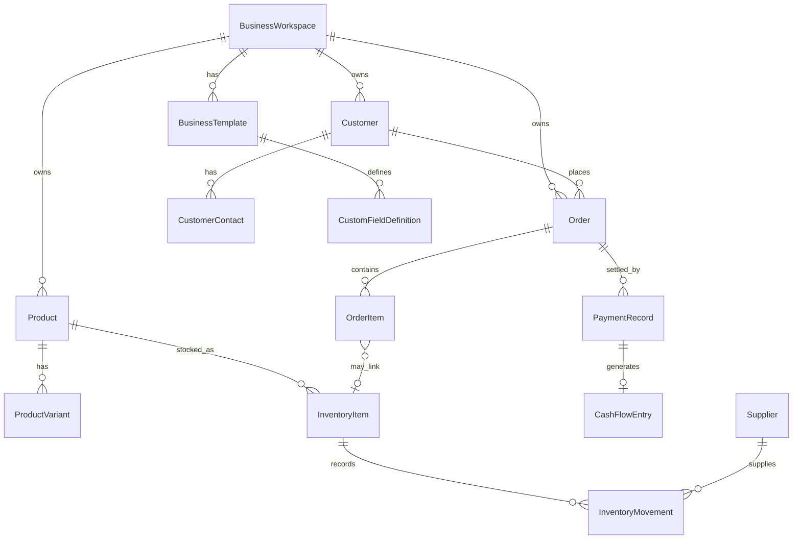

# Orderly 通用领域模型

本文档描述 Orderly 的行业无关通用领域模型（Universal Domain Model）。模型位于 `Orderly.Core/Commerce`，刻意保持中性、与任何具体行业无关，使 Orderly 能够表达任意小微商家的经营数据，而无需引入行业专属字段。

## 定位

Orderly 是一款本地优先的 PC 端经营管理系统，面向小微商家，覆盖成交销售、订单、库存、客户、现金流、数据分析与经营建议七大能力。所有业务数据均保存在本机，默认不依赖云端。

通用领域模型是整套系统的核心：服务层、数据层、模板系统与 WPF 界面都围绕这套中性模型构建。

## 设计原则

- **行业无关**：任何顶层字段名、类型名、类名、文件名或界面文案都不携带行业专属含义。
- **不改 schema 的个性化**：每个实体通过单一可空字符串字段 `CustomFieldsJson` 承载个性化数据，而非新增行业专属顶层字段。
- **订单三维独立阶段**：销售、收款、履约三个阶段维度彼此独立推进。
- **核心写入原子且幂等**：所有核心写入在单一事务内完成，并按业务键（Business_Key）幂等。
- **本地确定性洞察**：经营建议仅由本地确定性规则生成，主线不调用任何大语言模型。

## 值对象与枚举

通用领域模型在 `Orderly.Core/Commerce` 中至少定义以下 14 个行业无关的值对象与枚举，每个保持其既定职责：

| 类型 | 职责 |
|---|---|
| `CommerceMoney` | 十进制金额值对象，范围 −999,999,999.99…999,999,999.99，小数位精确为 2 位。 |
| `DateRange` | 起止日期窗口。 |
| `EntityLifecycleStatus` | 实体生命周期：活跃 / 归档 / 删除。 |
| `BusinessEntityType` | 枚举可被自定义字段与模板引用的实体类型。 |
| `CustomFieldDataType` | 自定义字段的数据类型。 |
| `OrderSalesStage` | 订单销售维度阶段。 |
| `OrderPaymentStage` | 订单收款维度阶段。 |
| `OrderFulfillmentStage` | 订单履约维度阶段。 |
| `CashFlowDirection` | 现金流方向：收入 / 支出 / 内部划转（账户间中性资金移动，对经营收支净额为零）。 |
| `CashFlowSettlementStatus` | 应收 / 应付条目的结算状态与到期信息。 |
| `InventoryMovementType` | 库存变动分类：入库 / 出库 / 调整。 |
| `ProductType` | 商品分类（实物 / 服务等）。 |
| `TaskStatus` | 经营任务状态。 |
| `InsightSeverity` | 生成洞察的严重级别。 |

在保持行业无关且不携带任何受限词的前提下，模型可额外定义中性的辅助值对象、DTO、结果对象、分页对象、校验对象与事务对象。

## 实体

通用领域模型在 `Orderly.Core/Commerce` 中至少定义以下 18 个实体，每个保持其既定职责：

`BusinessWorkspace`、`BusinessTemplate`、`CustomFieldDefinition`、`UnitDefinition`、`Product`、`ProductVariant`、`InventoryItem`、`InventoryMovement`、`Customer`、`CustomerContact`、`Order`、`OrderItem`、`PaymentRecord`、`CashFlowEntry`、`Supplier`、`BusinessTask`、`BusinessInsight`、`BusinessMetricSnapshot`。

实体关系概览：



## 通用实体结构

所有实体通过共享基类承载审计、生命周期与个性化字段：

```csharp
public abstract class CommerceEntity
{
    public Guid Id { get; init; }
    public DateTime CreatedAt { get; init; }        // UTC，非空，创建后不再变化
    public DateTime UpdatedAt { get; private set; } // UTC，非空，每次持久字段变更时刷新
    public DateTime? DeletedAt { get; private set; } // UTC，可空
    public EntityLifecycleStatus Lifecycle { get; private set; }
    public string? CustomFieldsJson { get; set; }   // 单一个性化字段
}

// 业务数据实体按工作区划分：归属于唯一一个 BusinessWorkspace。
public abstract class WorkspaceScopedEntity : CommerceEntity
{
    public Guid WorkspaceId { get; init; }          // 非空的归属工作区
}

// 系统 / 聚合根实体不按工作区划分，且不携带 WorkspaceId。
public abstract class SystemEntity : CommerceEntity { }
```

### 工作区划分

实体分为按工作区划分的业务实体与不划分的系统 / 配置实体。

- **工作区实体**（继承 `WorkspaceScopedEntity`，携带非空 `WorkspaceId`）：`Product`、`ProductVariant`、`InventoryItem`、`InventoryMovement`、`Customer`、`CustomerContact`、`Order`、`OrderItem`、`PaymentRecord`、`CashFlowEntry`、`Supplier`、`BusinessTask`、`BusinessInsight`、`BusinessMetricSnapshot`。
- **系统 / 非划分实体**：

| 实体 | 划分角色 |
|---|---|
| `BusinessWorkspace` | 划分根，自身即工作区，不携带 `WorkspaceId`。 |
| `BusinessTemplate` | 可为内置 / 系统级（唯一内置模板，无 `WorkspaceId`）或工作区级（用户创建 / 克隆的模板，`WorkspaceId` 可空：内置为 null，工作区自有则设值）。 |
| `CustomFieldDefinition` | 模板级，关联唯一一个 `BusinessTemplate` 与唯一一个实体类型，按 `TemplateId` 划分。 |
| `UnitDefinition` | 内置或模板级：内置单位为系统级（无 `WorkspaceId`），用户自定义单位按 `TemplateId` 划分。 |

## 审计、个性化与生命周期规则

- **金额**：所有金额以 `decimal` 表示，约束在 −999,999,999.99…999,999,999.99（含端点），小数位精确为 2 位。
- **时间戳**：每个实体携带非空 `CreatedAt`、非空 `UpdatedAt`、可空 `DeletedAt`，均以 UTC 存储。
- **变更**：任意持久字段变更时，`UpdatedAt` 刷新为当前 UTC 时间，`CreatedAt` 保持不变。
- **个性化**：`CustomFieldsJson` 按原值存储；实体在赋值时不做格式校验，格式良好性校验推迟到服务层与仓储保存边界完成（见数据模型文档）。
- **软删除 / 归档**：设置 `DeletedAt` 与对应的生命周期状态，保留实体数据，使其从活跃查询中排除但仍可恢复。
- **命名约束**：任何顶层字段名或类型标识符都不得携带受限词。

## 订单三维阶段模型

`Order` 同时持有三个彼此独立的阶段字段——`OrderSalesStage`、`OrderPaymentStage`、`OrderFulfillmentStage`——以及金额字段（小计、合计、成本、毛利、毛利率、已收金额、应收金额）。

- 收款动作不会强制改变销售或履约阶段；履约动作不会强制改变销售或收款阶段。
- 阶段流转由当前激活模板的工作流配置治理。工作流可定义“复合流转”，一次更新一个、两个或全部三个维度。
- 流转被允许时，只更新该流转命名的维度；不被允许时，三个维度全部保持不变并返回错误结果，不产生部分更新。

## 命名与受限词约束

通用领域模型刻意保持中性，使整套主线（`src/`、`tests/`、`tools/`、`README.md`、`docs/`）不出现任何客户专属、行业专属或历史项目专属痕迹。受限词的具体清单由回归测试在运行时构造，不在本文档、`README.md` 或任何被扫描的源码位置中复制，以避免触发生产环境的受限词扫描。
